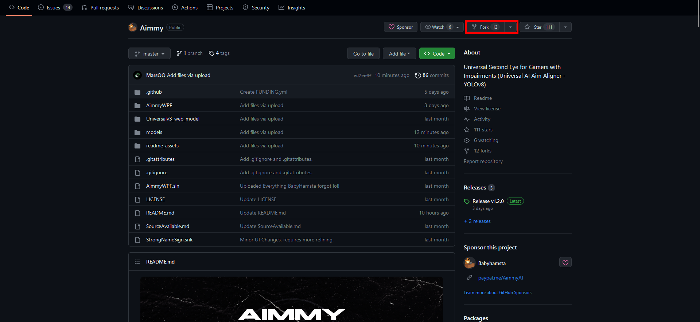
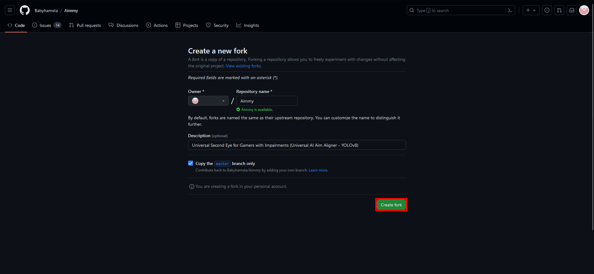
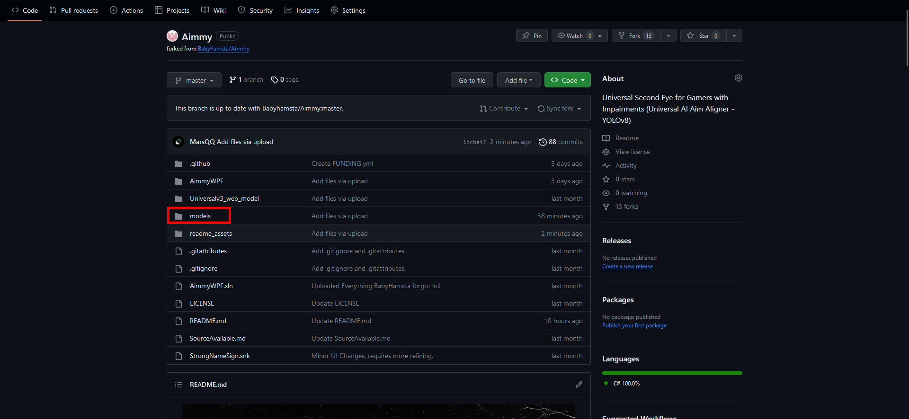
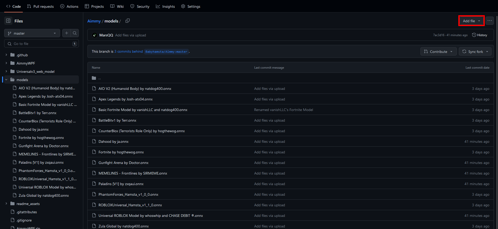
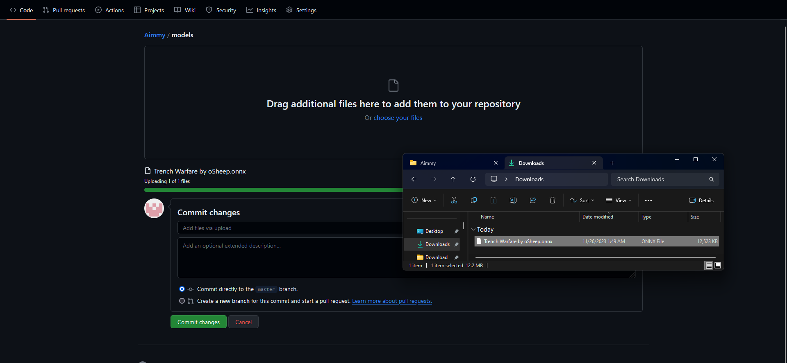
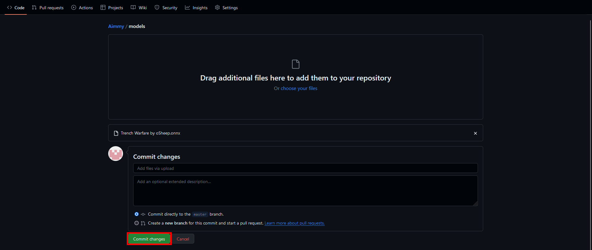
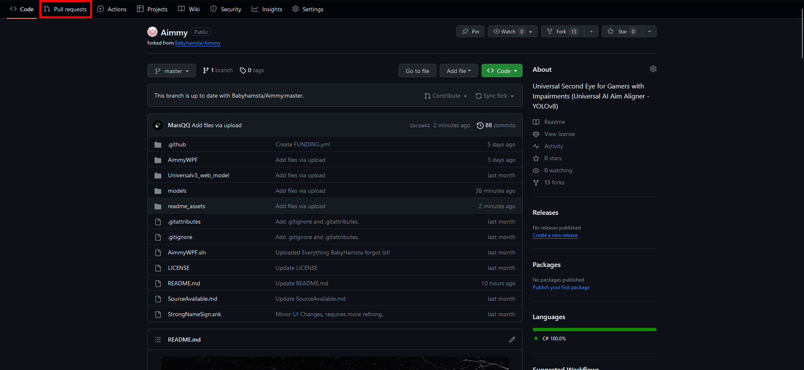
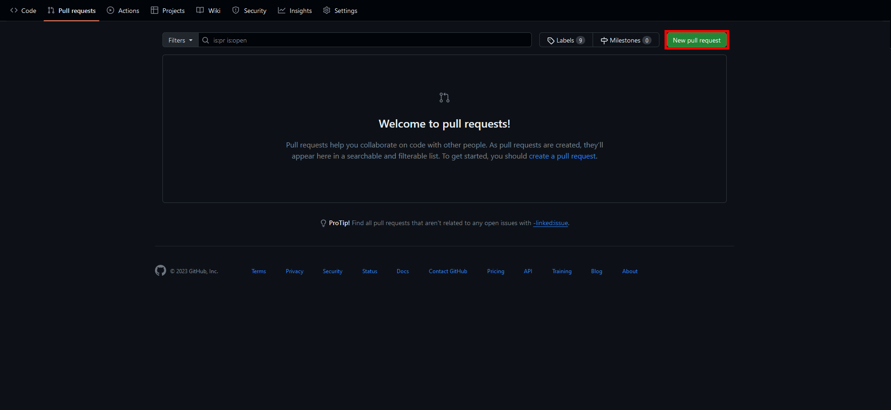
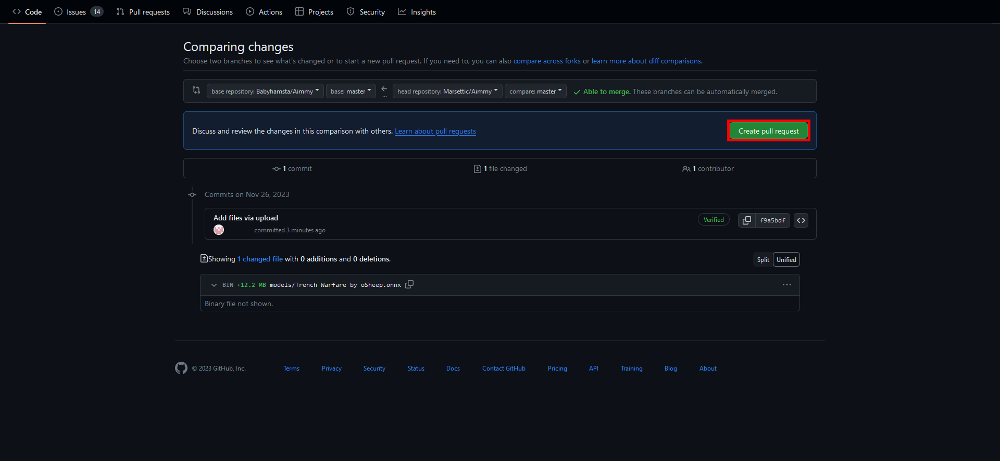
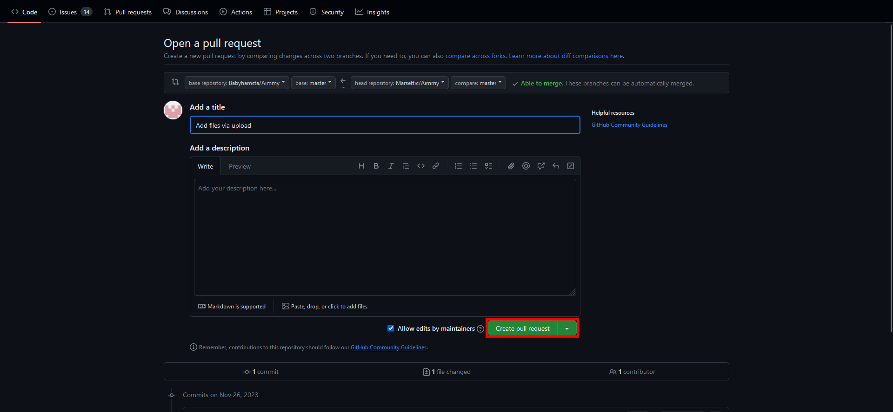

# Contributing Models to PowerAim

PowerAim has a **Downloadable Models** tab that pulls models from two GitHub repositories transparently:

1. **This repository** — `fgilde/AI-Ming` (the PowerAim fork)
2. **Upstream** — `Babyhamsta/Aimmy`

The in-app downloader merges both lists by filename. If the same model exists in both, the **newer commit wins**; on a tie, this repository wins. Users see one combined list without knowing which repo a given file comes from.

## How the merge works

For each pair of duplicate filenames, PowerAim calls the GitHub commits API once per file (`/commits?path=models/<name>&per_page=1`) and picks the entry with the latest commit date. If the API is unreachable or both timestamps are identical, the fork's copy wins. Downloads always come from the picked repo's `raw` URL — there is no proxy or mirroring.

## Naming convention

If you'd like to be credited, name your model:

```
[Game Name / Model Name] by [Your Handle]
```

If you'd rather stay anonymous, just use `[Game Name / Model Name]`.

## How to upload a model

You can submit a model to either repository — both feed the same downloader.

### Option A — upload to PowerAim's fork

1. Fork `https://github.com/fgilde/AI-Ming`
2. Drop your `.onnx` file into the `models/` directory of your fork
3. Open a Pull Request against `main`
4. Once merged, your model appears in everyone's in-app **Downloadable Models** tab on next refresh

### Option B — upload to the upstream Babyhamsta/Aimmy repo

1. Fork `https://github.com/Babyhamsta/Aimmy`
2. Add your `.onnx` to `models/`
3. Open a PR against `master`
4. The same model will be visible in PowerAim once the upstream PR is merged

## Visual walkthrough

The screenshots below are taken from the upstream Aimmy guide — the GitHub workflow is identical for either repo.




Go to your fork's `models` folder:


Press **Add File → Upload files**:


Drag your model onto the upload area:


Commit:


Switch to the **Pull requests** tab:


Create a new pull request:




Submit:


## Tips for high-quality models

- Use a YOLOv8 architecture exported to ONNX with NHWC → NCHW input order
- Input image size can be anything from 192 to 1280 (multiple of 32); PowerAim picks this up automatically from the ONNX metadata
- Multi-class models are supported — list class names in the `names` custom metadata field (Ultralytics convention `{0: "Enemy", 1: "Teammate"}` etc.)
- Include thousands of varied images (different maps, weapons, lighting, view angles) — PowerAim's detection quality is bottlenecked by training data, not by inference
- Test in-game with **Show Detected Player** enabled to verify class confidences are reasonable

## Removing a model

If you want a model removed, open another PR removing the file, or open an Issue against the repo where it lives.

---

Thank you for contributing! PowerAim and the wider community benefit massively from shared models.
