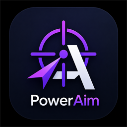
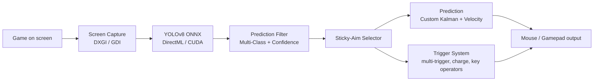

  

<h1 align="center">PowerAim</h1>

  <em>A modern, AI-powered aim alignment tool for accessibility, training, and fun.</em>

> [!NOTE]
> If you enjoy PowerAim, please consider giving the project a star ⭐ — it really helps. Thanks!

---

PowerAim is a **universal AI-based aim alignment tool**. It captures the screen, runs a YOLOv8 ONNX model on the frame, and nudges the mouse towards the detected target — fully configurable, with a clean Fluent UI built on .NET 10 and WPF.

PowerAim started as a fork of [Babyhamsta/Aimmy](https://github.com/Babyhamsta/Aimmy) but has since been heavily reworked: a decoupled service architecture, a complete trigger-system overhaul, a Fluent-styled UI, gamepad / AutoPlay support, localization in 9 languages, dynamic model sizes, and a much faster capture & inference pipeline.

PowerAim is **100% free**: no ads, no key system, no paywalled features. It is **source-available** but **not open source** — please do not make commercial forks.

---

## 📖 Documentation

Full, searchable documentation is published via GitHub Pages:

**[https://fgilde.github.io/AI-Ming/](https://fgilde.github.io/AI-Ming/)**

The docs cover installation, every feature in detail, model training, configuration reference, and troubleshooting. They are also bundled with the app and shipped offline — click the **Help** button in PowerAim's title bar to open them locally without an internet connection.

Quick links:
- 🚀 [Getting Started](https://fgilde.github.io/AI-Ming/getting-started/)
- 🎯 [Features](https://fgilde.github.io/AI-Ming/features/)
- 🎮 [Controller Mapping](https://fgilde.github.io/AI-Ming/features/controller-mapping/)
- 🤖 [AutoPlay](https://fgilde.github.io/AI-Ming/features/autoplay/)
- 🧠 [Training Your Own Model](https://fgilde.github.io/AI-Ming/models/training-your-own/)
- 🔧 [Troubleshooting](https://fgilde.github.io/AI-Ming/troubleshooting/)

---

## Table of Contents
- [Purpose](#purpose)
- [How it works](#how-it-works)
- [Features](#features)
- [Setup](#setup)
- [Trigger System](#trigger-system)
- [Performance Tools](#performance-tools)
- [Web Model & Training](#web-model--training)
- [Contributing Models](MODELS.md)
- [Credits](#credits)

---

## Purpose
PowerAim was designed for gamers who are at a real disadvantage relative to able-bodied players:
- Physically or visually impaired gamers
- Players without access to a separate HID for controlling the pointer
- People practicing reaction time / hand-eye coordination
- Anyone training their FPS aim mechanically
- Long-session players who develop fatigue or sweaty hands

It is also a great research / debugging tool for anyone interested in real-time object detection on the desktop.

## How it works

Each block is an independent service — the capture loop, the inference pipeline, the trigger logic, the aim/output loop. They communicate through clear contracts (`ICapture`, `IPredictionLogic`, `IAction`).

## Features

**Detection & inference**
- DXGI Desktop Duplication capture with automatic GDI fallback (≈6× faster than GDI alone)
- Dynamic ONNX input-size support — no more hardcoded 640×640
- Multi-class YOLO models with per-class filtering
- LUT-based byte→float tensor conversion (lower GC pressure)
- Built-in **Performance Benchmark** that recommends the optimal model size for your hardware
- Optional inference FPS cap

**Aim**
- Custom 2D Kalman filter with lead-time prediction
- Velocity-based Shalloe & WiseTheFox prediction methods (no longer the broken upstream versions)
- **Sticky Aim** target lock between frames — no flicker between overlapping detections
- Movement-path selector: Cubic-Bezier, Lerp, Exponential, Adaptive, or Perlin-noise jitter

**Trigger system**
- Multiple independent triggers per profile, each with its own keys and behavior
- Charge mode with `BeginIntersectionCheck` + `ExecutionIntersectionCheck`
- AND/OR operators for trigger keys and anti-trigger keys
- Sequential vs simultaneous action execution
- Configurable head-area sub-region

**UI / UX**
- Fluent-styled UI on .NET 10 (Mica backdrop, light / dark / system-follow)
- Hamburger sidebar navigation
- Localization in 9 languages (en, de, es, fr, it, ru, tr, uk, zh)
- Modern in-app `MessageDialog` (slides down from the window header)
- Live monitor / window picker with thumbnail previews and on-hover overlay highlights
- Gamepad Test page with virtual vJoy + AutoPlay system

**Anti-Recoil**
- OpenCV crosshair-tracking based anti-recoil (replaces the original simple recoil compensator)

**Mouse backends**
- SendInput, MouseEvent, LG HUB, Razer Synapse, ddxoft

## Setup
1. Install the x64 version of [.NET Runtime 10](https://dotnet.microsoft.com/en-us/download/dotnet/10.0)
2. Install the x64 version of the [Visual C++ Redistributable](https://aka.ms/vs/17/release/vc_redist.x64.exe)
3. Download the latest PowerAim release from the [Releases](https://github.com/fgilde/AI-Ming/releases) page
4. Either run the `Installer.exe`, or extract the `.zip` and run the bundled `.exe`
5. Pick a model in the Models tab and click **Active** — that's it

For CUDA acceleration, download the `_cuda` variant of the release.

## Trigger System
PowerAim's trigger system is a complete rewrite of the original Aimmy autotrigger.

- Each **trigger** is an `ActionTrigger` with its own name, active state, keys, actions, intersection checks, and timing.
- **Trigger Keys / Anti-Trigger Keys** support AND or OR operators — combine `LMB AND Shift`, or `LMB OR Q`, or `NOT (R OR Tab)` to block firing while reloading.
- **Charge Mode** lets the trigger pre-aim while a button is held: enters when the target enters the configured *begin* head-area, executes when it enters the *execution* head-area.
- **Sequential / Simultaneous** action mode controls whether multiple actions are sent in order or all at once.

Open `Aim Tools → Triggers → Edit` to configure visually with live previews.

## Performance Tools
- **Run Benchmark** (Models tab) measures FPS / inference time / GPU% across a set of image sizes (320 / 416 / 512 / 640 / 800) and recommends the largest size that still hits ≥60 FPS on your hardware.
- **Max Inference FPS** (Prediction Config) lets you cap the loop — useful for laptops where you want to keep thermals in check.
- **Image Size Override** (Models) is used for ONNX models with dynamic input shapes.

## Web Model & Training
The repo contains a TFJS export under `Universalv3_web_model/`. It is intended to help auto-label new training data via [MakeSense.ai](https://www.makesense.ai). Load your images, pick *Object Detection*, run the AI locally with YOLOv5, upload the web-model files, label, and export.

A short walkthrough video for training your own model:

## Want to contribute a model?
See **[MODELS.md](MODELS.md)** for the full step-by-step guide. PowerAim's in-app downloader merges models from this fork **and** from the upstream Babyhamsta/Aimmy repo — newer commit wins on a name conflict, fork wins on a tie.

## Credits

PowerAim is built on the shoulders of [Babyhamsta/Aimmy](https://github.com/Babyhamsta/Aimmy) by BabyHamsta, MarsQQ and Taylor — without their original work and ONNX/DirectML wiring this project would not exist. Thank you. ❤️

**Model creators (kept from upstream):**
- Babyhamsta — UniversalV4, Phantom Forces
- Natdog400 — AIO V2, V7
- Themida — Arsenal, Strucid, Bad Business, Blade Ball, LGHub check
- Hogthewog — Da Hood, FN
- Ninja — MarsQQ's emotional support

PowerAim is **source-available** (see [SourceAvailable.md](SourceAvailable.md)). Commercial forks are not permitted.
