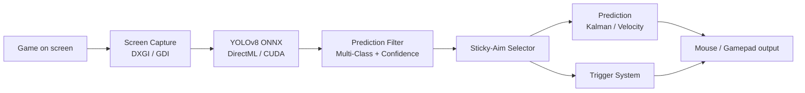

# Architecture

A high-level tour of how PowerAim turns a screen frame into a mouse delta.

## The pipeline



Each block is an independent service with a contract:

- `ICapture` — `LastCapture: Bitmap`, `CaptureArea: Rectangle`
- `IPredictionLogic` — runs inference, exposes `ModelClasses`, raises events with detections
- `IAction` — `Active: bool`, `Execute(...)` — implementations include `AimingAction`, `AntiRecoilAction`, `RecoilPatternPlaybackAction`, `ImageBasedAntiRecoilAction`, `AutoPlayLearningAction`

The composition root is `AIManager`, which:

1. Owns one `ICapture` instance (DXGI or GDI based on machine probing)
2. Owns one `IPredictionLogic` instance built around `OnnxModelSessionFactory`
3. Hosts a list of `IAction`s and ticks them every frame

## Capture

`ScreenCapture` is a façade that delegates to either:

- `DxgiScreenCapture` — Vortice.Direct3D11 + DXGI Desktop Duplication. ~6× faster than GDI. Used by default when probing succeeds.
- `GdiScreenCapture` — `BitBlt` fallback for systems where DXGI is unavailable or restricted (older Windows, headless, RDP).

Both expose the same `ICapture` API. The choice is made once per `ScreenCapture` construction.

The capture source is configurable in the title bar — entire monitor or a specific window. Window-mode capture uses `ProcessCapture`, which `PrintWindow`s the target window with DXGI fallback to BitBlt when the target is on a different DPI / GPU adapter.

## Inference

`OnnxModelSessionFactory` builds the ONNX Runtime session with an execution-provider fallback chain:

1. **DirectML** (default build) or **CUDA** (`_cuda` build)
2. **CPU** fallback if the GPU path errors

It also probes the input shape:

- **Fixed shape** (e.g. `1×3×640×640`) — `SliderSettings.ImageSize` is snapped to the model's declared size
- **Dynamic shape** (e.g. `1×3×?×?`) — the user picks via the Image Size Override slider

Pixel-to-tensor conversion uses a **byte→float LUT** for lower GC pressure than naive `bitmap.Lock + cast`.

## Prediction filter

`PredictionFilter` runs after the model and applies:

- Minimum confidence (configurable via `AIMinimumConfidence`)
- Class filtering (`AISettings.TargetClassFilterMode` + `TargetClassIds`)
- Detection-mask exclusion (`AISettings.IgnoreRegions`)

Anything that survives moves on to the sticky-aim selector.

## Sticky-aim selector

`StickyAimSelector` keeps a *target lock* between frames using a composite score:

- **Distance score** — pixel distance to the screen center, weighted within `StickyAimThreshold`
- **Confidence score** — the model's own probability
- **Size score** — favors larger detections (closer = bigger)
- **Lock bonus** — accumulates over time on the currently-held target, capped at `StickyAimMaxLockScore`

The selector switches targets only when a non-locked candidate beats the locked target by a clear margin. This eliminates the "ping-pong" effect of two overlapping detections.

## Prediction (lead-time)

`PredictionManager` picks one of three methods:

- **Kalman Filter** — custom 2D Kalman with velocity state. Lead time is fixed by default; the **Adaptive Kalman Lead** toggle adapts it to measured target velocity.
- **Shall0e's Prediction** — velocity-based linear lead. PowerAim fixed the broken upstream implementation.
- **wisethef0x's EMA Prediction** — EMA-weighted velocity lead.

The chosen method produces a *predicted* target position for `N` ms in the future.

## Aim / output

`AimingAction.Execute(prediction)`:

1. Apply X/Y offsets (pixel + percentage)
2. Apply EMA smoothing
3. Compute mouse delta via the chosen `MovementPathType` (Bezier / Lerp / Exponential / Adaptive / PerlinNoise)
4. Scale by `MouseSensitivity`
5. Send via the configured `MouseMovementMethod` (SendInput / ddxoft / Razer / LGHub / MouseEvent) **or** via `GamepadManager.GamepadSender` if `UseControllerForAim` is on

The trigger system runs in parallel — `TriggerEngine` evaluates each `ActionTrigger` and fires its actions when keys + intersection rules are satisfied.

## Anti-Recoil

Three independent implementations, evaluated in precedence order:

1. **`RecoilPatternPlaybackAction`** — replay a recorded delta sequence
2. **`ImageBasedAntiRecoilAction`** — OpenCV phase-correlation + EMA baseline (BETA)
3. Legacy fixed X/Y compensation (built into `AntiRecoilAction`)

Only the highest-precedence active mode produces output; the others self-disable.

## Controller mapping

`MappingEngine` is a singleton that:

1. Hooks keyboard + mouse via `Gma.System.MouseKeyHook`
2. Polls XInput at 1 ms via SharpDX.XInput
3. Resolves the active profile (first enabled, `MatchProcess`-matching profile)
4. Reads each `InputMapping`'s source state, evaluates activator + modifier, writes the target
5. Mouse-to-stick and stick-to-mouse pumps are special — driven by sentinel mappings

For KB→Pad writes, the engine **takes ownership** of the channels it touches on the shared `GamepadManager.GamepadSender` — otherwise the sync loop (which mirrors the physical pad onto the virtual one every 1 ms) would immediately overwrite the mapping output.

## AutoPlay

`AutoPlayLearningAction` orchestrates:

1. `OllamaClient.SelectActionAsync` — sends the captured frame + game context + action list to Ollama
2. Receives an action name
3. Sends the corresponding input(s) via the same dispatch as triggers
4. Optionally records the (state, action) pair into `AutoPlayLearningModel` for bias learning

`AutoPlayLearningModel` is a tiny state→action frequency table persisted as JSON.

## OCR

`OcrService` is a polling timer (configurable interval) that:

1. Captures each enabled `OcrRegion`
2. Pre-binarizes (threshold + optional invert)
3. Runs Tesseract 5.2
4. Post-processes per `OcrRegionKind` (Number = digits only, Health = number + slash, Text = free-form)
5. Stores results in `OcrService.Latest`

Other subsystems can read `Latest` to drive triggers or AutoPlay decisions.

## Replay buffer

`ReplayBuffer.Push(frame, predictions)` JPEG-encodes the frame on insert into a ring buffer sized at `BufferSeconds × FPS`. `ExportAsync()` flushes the ring to a timestamped folder.

Threading: insertion is lock-protected but cheap; export runs on a thread-pool task so the AI loop never blocks.

## Threading

- **UI thread** — WPF window, every dialog, the binding hook listener
- **Capture thread** — DXGI / GDI capture, owned by `AIManager`
- **AI loop thread** — inference + prediction + action dispatch
- **Mapping engine thread** — 1 ms tick polling XInput
- **OCR timer** — DispatcherTimer on the UI thread

Cross-thread state is `INotifyPropertyChanged` with WPF dispatcher marshaling.

## Dependency graph

```
AppConfig (singleton)
  └─ owns SliderSettings, ToggleState, BindingSettings, ...

AIManager (composition root)
  ├─ ICapture (Dxgi / Gdi)
  ├─ IPredictionLogic (OnnxModelSessionFactory)
  ├─ Action list: AimingAction, AntiRecoilAction, ...
  └─ ReplayBuffer.Instance

GamepadManager (singleton)
  ├─ IGamepadReader (XInput polling)
  └─ IGamepadSender (ViGEm / vJoy / Internal / XInputEmu)

MappingEngine (singleton)
  ├─ Mouse/Keyboard hook
  ├─ XInput poll
  └─ GamepadManager.GamepadSender (shared)

InputBindingManager (singleton)
  └─ low-level keyboard + mouse hook

WindowFocusWatcher (singleton)
  └─ foreground process polling for AutoPause / AutoSwitch
```

## Source layout

```
PowerAim/
├── AILogic/                # capture, inference, prediction, replay, anti-recoil
│   ├── Actions/             # IAction implementations
│   ├── Contracts/           # ICapture, IPredictionLogic, IAction, IOllamaClient
│   └── ...
├── InputLogic/             # mouse + gamepad input
│   ├── Gamepad/             # ViGEm/vJoy/Internal/XInputEmu senders + readers
│   ├── HidHide/             # HidHide CLI integration
│   └── Mapping/             # MappingEngine + presets + converters
├── Config/                 # AppConfig + every SettingsCard's persisted state
├── MouseMovementLibraries/ # GHubSupport, RazerSupport, SendInputSupport, ddxoftSupport
├── Visuality/              # dialogs and overlay windows
├── UILibrary/              # custom WPF controls (AToggle, ASlider, AKeyChanger, ...)
├── Localizations/          # Locale.json + per-language JSONs
└── MainWindow.xaml + .cs    # composition + sidebar navigation
```

For licensing, see [Source Available]({{ '/advanced/source-available' | relative_url }}).
