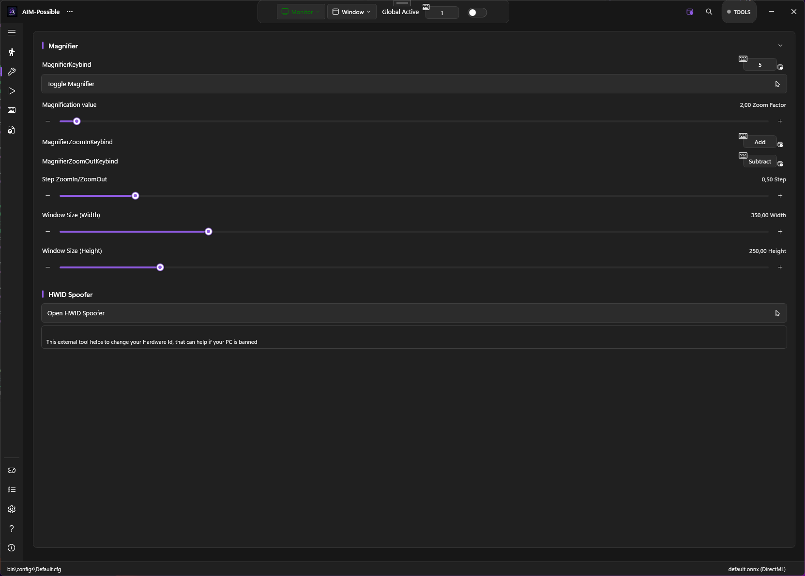

# Keybinds & Hotkeys

PowerAim supports global hotkeys — keys that work even when the PowerAim window isn't focused. Every major toggle can be bound to a key.

## How key binding works

Every keybind chip in PowerAim:

- Shows the current binding (e.g. `Right Mouse Button + Left Alt`)
- When clicked, enters "press a key" mode — the next physical key, mouse button, or gamepad button you press becomes the binding
- Supports multi-key bindings (`RMB OR LAlt`) on chips that allow multi-key (the trigger / aim key chips)
- Press `Esc` while listening to cancel; press `Delete` to clear

The binding is captured via a low-level keyboard + mouse hook (`Gma.System.MouseKeyHook`), so it works regardless of which application has focus.

## Common keybinds

| Feature | Default binding | Where to change |
|:--------|:----------------|:----------------|
| **Aim Key Bindings** | RMB + LAlt | Aim Tools → Aim Assist → Aim Key Bindings |
| **Anti-Recoil** | LMB | Aim Tools → AntiRecoil → Anti-Recoil Keybind |
| **Disable Anti-Recoil** | `]` | Aim Tools → AntiRecoil → Disable Anti-Recoil Keybind |
| **Dynamic FOV** | LMB | Aim Tools → FOVConfig → Dynamic FOV Keybind |
| **Magnifier** | (none) | Tools → Magnifier → Magnifier Keybind |
| **Magnifier Zoom In/Out** | `+` / `-` | Tools → Magnifier |
| **Model Switch** | (none) | Aim Tools → Model Settings → Model Switch Keybind |
| **Gun 1 / Gun 2** | `1` / `2` | Aim Tools → AntiRecoilConfig |

The Magnifier and HWID Spoofer live on the **Tools** page:

## Toggle hotkeys

Many toggles have a **chip next to them** that lets you bind a global hotkey for the toggle itself. Press the hotkey in-game to flip the toggle on/off without alt-tabbing.

Toggles with hotkey support:

- Global Active (master toggle)
- Aim Assist
- AutoTrigger
- Anti-Recoil
- FOV
- Dynamic FOV
- Predictions
- EMA Smoothening
- Show Detected Player
- Show Trigger Head Area
- Show AI Confidence
- Show Tracers
- Show Sizes
- Show Debug Overlay
- Show Custom Crosshair
- AutoPlay
- Mapping Active
- Use Controller for Aim
- Ensure Capture Process Foreground
- Show Captured Area
- Enable Gun Switching Keybind
- Enable HUD OCR

## Trigger keys

Triggers have **two** lists of keys per trigger (configured per-trigger in the trigger editor):

- **Trigger Keys** — keys/buttons that arm the trigger (AND / OR operator)
- **Anti-Trigger Keys** — keys that block the trigger while held (AND / OR operator)

These can mix keyboard, mouse, and gamepad inputs. The AND/OR operator means `LMB AND Shift` fires only when both are held; `LMB OR Q` fires when either is held.

## Tips

- **Bind master toggles to F-keys.** F6 = Global Active, F7 = Aim Assist, etc. Saves alt-tabbing.
- **The Dynamic FOV keybind defaults to LMB** so it engages on shooting. Change to RMB if you want it on ADS.
- **`Delete` clears a binding.** Useful when you've bound something to RMB and want to un-bind.
- **Avoid binding to keys you use for typing.** A global keybind on `W` would trigger every time you type a `w`.

## Implementation note

PowerAim uses a low-level hook installed by `Gma.System.MouseKeyHook`. This hook runs at the OS level — your bindings work in fullscreen games and during loading screens. The hook also reads gamepad state via SharpDX.XInput, so gamepad button "bindings" come through the same chip without needing an extra hook layer.

## Troubleshooting

- **Hotkey doesn't fire in-game** — some games sandbox keyboard hooks. Try a different key or run PowerAim as administrator.
- **Two keybinds collide** — PowerAim doesn't deduplicate; if `F6` is bound to two different toggles, both fire. Re-bind one.
- **Modifier keys (Shift, Ctrl, Alt) don't bind** — they do, but use the left/right variants (`LShift` vs. `RShift`). The chip listens for distinct VK codes.
- **Mouse-5 / Mouse-4 don't bind** — they do, but PowerAim shows them as `XButton1` / `XButton2`.
