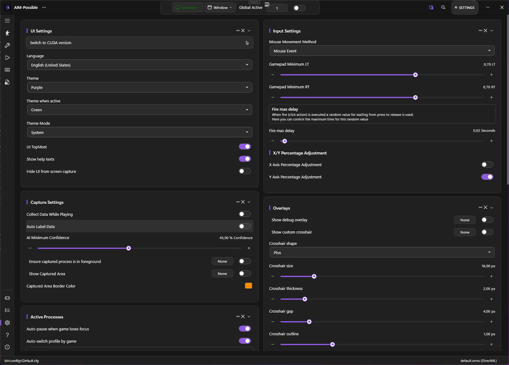

# Settings Overview

Every option on PowerAim's **Settings** sidebar page, organized by card.

The Settings page has 9 cards. Some controls are also exposed on the relevant feature page (e.g. crosshair settings appear both here and on the Overlays card) — this page is the authoritative list.

## UI Settings

| Setting | What it does | Default |
|:--------|:-------------|:--------|
| **Switch to DirectML / CUDA** | One-click switch between the DirectML and CUDA release builds | — |
| **Language** | UI language. 9 options: en, de, es, fr, it, ru, tr, uk, zh | System |
| **Accent color** | Free color picker for the UI accent while idle (Global Active off) | Purple |
| **Accent color when active** | A separate accent used while **Global Active** is on | Green |
| **Theme Mode** | Light / Dark / System-follow | System |
| **UI Top Most** | Keep PowerAim window above other windows | On |
| **Show Help Texts** | Show inline tooltips and help labels | On |
| **Show toggle notifications** | When a toggle is flipped via its global keybind, briefly show an on-screen notice (e.g. "Aim Assist is now on") | On |
| **Hide UI from Capture** | Use Win32 capture exclusion so OBS / NVIDIA ShadowPlay can't see PowerAim's window | On |

{: .note }
The old **Theme** / **Theme when Active** palette dropdowns have been replaced by free **accent-color** pickers. The 6 former palettes (Purple, Green, etc.) survive as quick-fill swatches inside the picker, so you can still pick them with one click — or choose any custom color. Light / Dark / System mode is unchanged.

### In-app color picker

Everywhere PowerAim asks for a color — the two accent colors above, the FOV ring color, the captured-area border color, the detected-player box color, and the crosshair fill / outline colors — it now opens its own **HSV color picker** instead of the old Windows color dialog. The picker has a saturation/value spectrum, a hue slider, a hex input, and a row of quick-fill swatches.

{: .important }
Disabling **Hide UI from Capture** is irreversible during the session — PowerAim warns you and asks for confirmation. The default protects you from inadvertently broadcasting PowerAim during a stream.

## Capture Settings

| Setting | What it does | Default |
|:--------|:-------------|:--------|
| **Collect Data While Playing** | Saves capture frames as JPEGs to `bin\images\` during play (throttled to ~2/sec). See [Training Your Own]({{ '/models/training-your-own#in-app-training-data-capture' | relative_url }}). | Off |
| **Auto Label Data** | Also writes a YOLO `.txt` label file to `bin\labels\` for each captured frame, from the current model's detections | Off |
| **AI Minimum Confidence** | Drop detections below this confidence threshold (1–100%) | 45% |
| **Ensure Capture Process Foreground** | Pause AI loop unless the capture target is the foreground window | Off |
| **Show Captured Area** | Draw a border around the captured region | On |
| **Captured Area Border Color** | Color of that border | Accent |

## Input Settings

| Setting | What it does | Default |
|:--------|:-------------|:--------|
| **Mouse Movement Method** | MouseEvent / SendInput / LG HUB / Razer / ddxoft. See [Mouse Input Methods]({{ '/features/mouse-input-methods' | relative_url }}). | MouseEvent |
| **Gamepad Minimum LT** | LT pull (0–1) below which the trigger is treated as released | 0.7 |
| **Gamepad Minimum RT** | RT pull (0–1) below which the trigger is treated as released | 0.7 |
| **Fire Max Delay** | Maximum seconds to wait after the fire impulse before considering it stuck. 0 = wait forever. | 0.1 |
| **X-Axis Percentage Adjustment** | Use percentage-based X offset (in addition to pixel offset) | Off |
| **Y-Axis Percentage Adjustment** | Same for Y | On |

## Active Processes

The Auto-Pause and per-game profile-switching card. See [Per-game Profiles]({{ '/configuration/per-game-profiles' | relative_url }}).

| Setting | What it does | Default |
|:--------|:-------------|:--------|
| **Auto Pause on Focus Loss** | Pause the AI loop while the foreground window is a recognised non-game (browser, terminal) | On |
| **Auto Switch Profile** | Triggers / mapping profiles with a `MatchProcess` pattern only activate while the foreground process matches | On |
| **Game Process Patterns** | Comma-separated whitelist of process names that count as "games" | empty |

## Overlays

See [Crosshair Overlay]({{ '/features/crosshair-overlay' | relative_url }}) and [Debug Overlay]({{ '/features/debug-overlay' | relative_url }}).

| Setting | What it does | Default |
|:--------|:-------------|:--------|
| **Show Debug Overlay** | Topmost diagnostic panel | Off |
| **Show sent-input visualizer** | Inside the debug overlay, show a live keyboard + mouse + controller diagram of the input PowerAim is sending. See [Debug Overlay]({{ '/features/debug-overlay#sent-input-visualizer' | relative_url }}). | Off |
| **Show Custom Crosshair** | Topmost custom crosshair | Off |
| **Crosshair Shape** | Dot / Cross / Plus / Circle / CircleDot / T | Plus |
| **Crosshair Size** | 4–80 px | 16 |
| **Crosshair Thickness** | 1–10 px | 2 |
| **Crosshair Gap** | 0–30 px (Plus + Cross only) | 4 |
| **Crosshair Outline** | 0–6 px | 1 |

## Stats

See [Session Stats]({{ '/features/session-stats' | relative_url }}). Shows live FPS / inference time / detections / shots / frames / tactical actions / session duration. Includes:

- **Reset Stats** — clears session counters
- **Adaptive Kalman Lead** — auto-adapt the Kalman lead time to measured target velocity

## HUD OCR

See [OCR]({{ '/features/ocr' | relative_url }}).

| Setting | What it does | Default |
|:--------|:-------------|:--------|
| **Enable HUD OCR** | Master toggle | Off |
| **OCR Interval** | 100–5000 ms | 500 |
| **Configure OCR Regions** | Opens the per-region editor | — |

## Replay Buffer

See [Replay Buffer]({{ '/features/replay-buffer' | relative_url }}).

| Setting | What it does | Default |
|:--------|:-------------|:--------|
| **Record Rolling Buffer** | Master toggle | Off |
| **Buffer Length** | 1–30 seconds | 3 |
| **JPEG Quality** | 10–100 | 70 |
| **Save Replay Buffer** | Flush to `%LocalAppData%\PowerAim\replays\<timestamp>\` | — |
| **Clear Buffer** | Drop everything | — |

## AutoPlay Learning

See [AutoPlay]({{ '/features/autoplay#learning-mode' | relative_url }}).

| Setting | What it does | Default |
|:--------|:-------------|:--------|
| **Record Playstyle** | While on, samples your input state every `SampleInterval` ms | Off |
| **Apply Learned Bias** | Bias AutoPlay's selector toward the recorded preference | Off |
| **Bias Strength** | 0 (ignore) – 1 (dominate) | 0.5 |
| **Sample Interval** | 50–1000 ms | 150 |
| **Save / Load / Clear Model** | Persist or reset the JSON state | — |

## Customizing the layout

The cards on every page can be rearranged and pruned to fit how you work — the layout is saved per page and restored on next launch.

- **Drag to reorder.** Each card shows a small drag handle near its top-right corner. Drag it to move the card within its column; on two-column pages you can also drag a card across to the other column.
- **Hide a card.** Next to the drag handle is a small **×** that hides the card.
- **Restore hidden cards.** When at least one card on the current page is hidden, a floating pill (e.g. "3 hidden sections") appears in the bottom-right corner. Click it for a flyout listing the hidden cards; click any entry to bring it back.

## Instant search

Press **Ctrl+F** anywhere in the app to open a search box. It indexes the labels of settings and section headers across the whole window — toggles, sliders, keybinds, color pickers, buttons, and section titles, plus their help/tooltip text — and matches as you type.

Pick a result (click it or press **Enter** for the first match) and PowerAim switches to the right page, scrolls the control into view, and briefly **flashes** its border so your eye lands on it.

## Hotkey safeguards

Two options change how global keybinds behave:

| Setting | What it does | Default |
|:--------|:-------------|:--------|
| **Show toggle notifications** | When a toggle is flipped via its global keybind, briefly show an on-screen notice of the new on/off state. (Also listed under UI Settings.) | On |
| **Require Global Active for keybinds** | Global keybinds (toggle hotkeys, trigger / mapping enable hotkeys, model & config switch hotkeys, …) only fire while **Global Active** is on. The Global Active hotkey itself is always exempt so you can switch back on. | On |

## Related controls (outside the Settings cards)

A few inference-related controls live elsewhere in the app rather than on the Settings page, but are worth knowing about here:

| Control | Where | What it does |
|:--------|:------|:-------------|
| **Image Size Override** | Models page | Slider (192–1280 px) that sets the runtime square input size. Only meaningful for dynamic-shape ONNX models — fixed-size models snap to their declared dimension. Bound to `SliderSettings.ImageSize`. See [Training Your Own]({{ '/models/training-your-own' | relative_url }}). |
| **GPU device picker** | Title-bar pill ("GPU") | Lists the DXGI adapters PowerAim detects and lets you pick which one runs ONNX inference (`AISettings.InferenceGpuDeviceId`). Lets you keep inference off the GPU the game runs on. The model reloads on the new device when you switch. |

{: .note }
The **Switch to DirectML / CUDA** button (UI Settings, above) swaps the whole app between the two release builds from inside it: it finds the matching release, downloads the other build, and updates in place via the same [updater]({{ '/getting-started/installation#updating' | relative_url }}) — your config is preserved.
