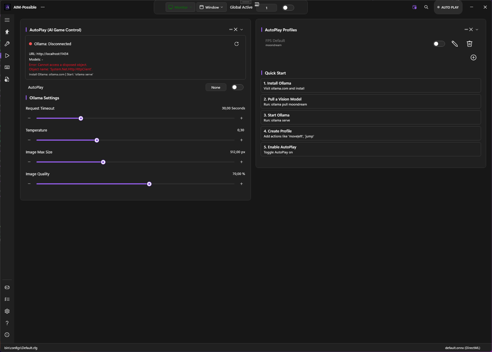
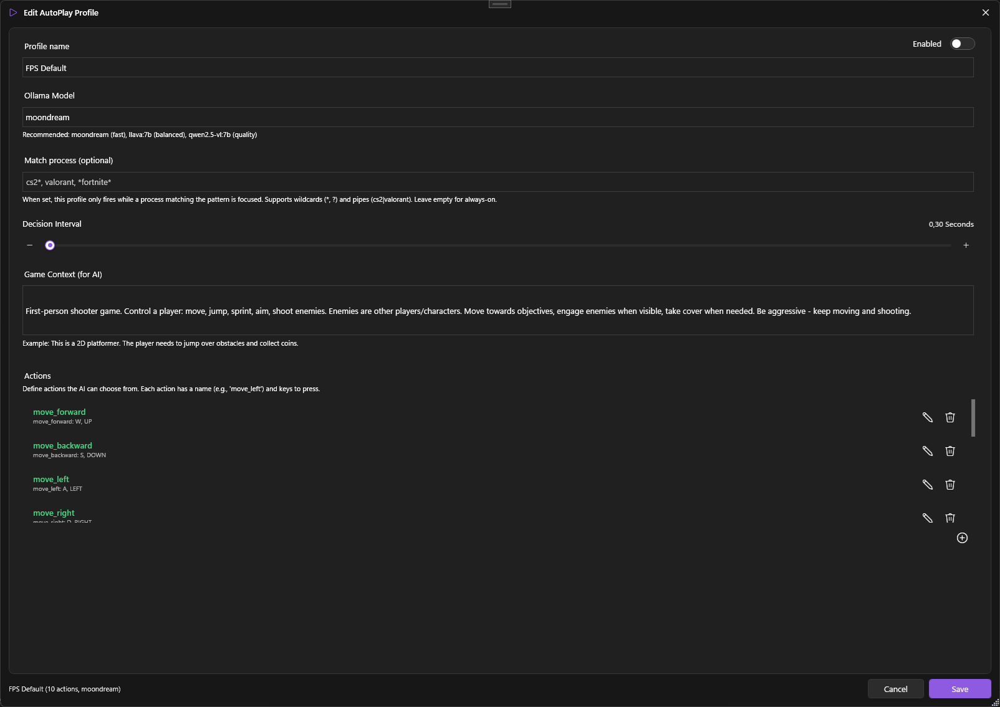
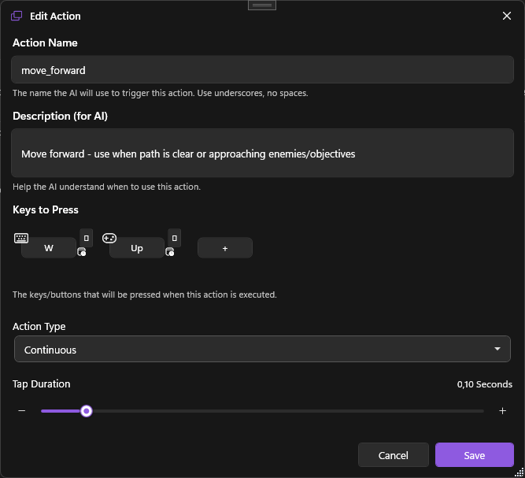

# AutoPlay

Let a local vision-capable LLM (Ollama) **play the game for you**. PowerAim captures the screen, sends it to the LLM with a context prompt + list of available actions, then executes whichever action the model picks.



## What it does

Every `DecisionInterval` seconds while AutoPlay is on:

1. PowerAim screenshots the current frame
2. Compresses it (JPEG, configurable max size + quality)
3. Sends it to Ollama at `http://localhost:11434` along with the active profile's `GameContext` prompt and action list
4. The LLM returns the name of one action
5. PowerAim sends the corresponding input(s)

Actions can be:

- **Instant** — press + release once (jumps, reloads)
- **Continuous** — hold while AutoPlay still wants this action (movement)
- **Modifier** — held while another action is concurrent (aim-down-sights)
- **Toggle** — flip a latched key (crouch toggle)

## Prerequisites

1. Install [Ollama](https://ollama.com)
2. Pull a vision model:
   ```
   ollama pull moondream
   ```
   Other vision models: `llava:7b`, `qwen2.5-vl:7b`. `moondream` is the fastest; `llava` is balanced; `qwen2.5-vl` is highest quality.
3. Make sure Ollama is running (it auto-starts on Windows after install)

## How to enable

1. **AutoPlay** in the sidebar
2. The **Ollama Status Indicator** at the top should show green ("Connected"). If red, see [Troubleshooting](#troubleshooting) below.
3. Toggle **AutoPlay** on
4. Pick or create a profile (see below)

## Profiles

Each profile holds:

| Field | What it does |
|:------|:-------------|
| **Name** | Free text |
| **Enabled** | Per-profile toggle (only enabled profiles are candidates for activation) |
| **OllamaModel** | Which Ollama model to call (e.g. `moondream`) |
| **DecisionInterval** | Min seconds between decisions (0.3–2.0 typical) |
| **GameContext** | Prompt describing the game and what the LLM should do |
| **MatchProcess** | Optional process pattern — limits this profile to a specific game |
| **Actions** | The list of action names + descriptions + key bindings |

PowerAim ships a **"FPS Default"** profile with 10 actions covering WASD movement, jump, shoot, aim, reload, crouch, sprint. Use it as a template.



### Game context prompt

The `GameContext` is the most important field. It tells the LLM:

- What kind of game is on screen
- Who the player is
- What the goal is
- General strategy advice

Example for an FPS:

> First-person shooter game. Control a player: move, jump, sprint, aim, shoot enemies. Enemies are other players/characters. Move towards objectives, engage enemies when visible, take cover when needed. Be aggressive — keep moving and shooting.

Example for a 2D platformer:

> 2D platformer game. Avoid spikes and pits, collect coins, jump on enemies to defeat them. Reach the right edge of the screen.

### Actions

Each action has:

- **Name** — what the LLM should return (e.g. `move_forward`)
- **Description** — what this action does + when to use it (the LLM reads this!)
- **Keys** — what PowerAim sends when this action is picked. Multiple keys = pressed together. Mix keyboard / mouse / gamepad.
- **ActionType** — Instant / Continuous / Modifier / Toggle

The Edit dialog opens via the profile editor and provides a per-action form.



## Ollama settings

On the AutoPlay page:

| Setting | What it does | Default |
|:--------|:-------------|:--------|
| **Request Timeout** | Seconds before giving up on an LLM call. Increase for slow models. | 30 |
| **Temperature** | LLM creativity (0.0 deterministic, 1.0 creative). 0.1–0.3 is recommended for gaming. | 0.3 |
| **Image Max Size** | Compress capture to this max dimension before sending. Smaller = faster but less detail. | 512 |
| **Image Quality** | JPEG quality 1–100 for the sent image. Lower = faster network round-trip. | 70 |

These are global — they apply to every AutoPlay profile.

## Learning mode

AutoPlay has an opt-in **learning subsystem** that captures *your* playstyle while you play and biases future AutoPlay decisions toward what you actually do.

On the **Settings page → AutoPlay Learning** card:

| Setting | What it does |
|:--------|:-------------|
| **Record Playstyle** | While on, every AI tick samples your current input state and accumulates state→action counts |
| **Apply Learned Bias** | Bias AutoPlay's selector toward the recorded preference |
| **Bias Strength** | 0 (ignore the model) – 1 (let the model dominate). 0.5 default. |
| **Sample Interval** | Min ms between samples (50–1000) |

The model is a tiny JSON file at `%LocalAppData%\PowerAim\autoplay_model.json` that you can inspect, share, or version-control.

## Tips

- **Start with `moondream`.** It's tiny and decides in ~100 ms on most GPUs.
- **Lower the DecisionInterval as you get a feel for your model's speed.** Moondream can sustain 5+ decisions/sec; qwen2.5-vl might be ~1/sec.
- **Iterate on the GameContext prompt.** Small wording changes massively change behavior. If AutoPlay won't shoot, mention "shoot enemies" more aggressively.
- **Use Match Process to scope a profile to one game.** Otherwise the LLM might apply your FPS profile to your menu screen.
- **Watch the Tactical Actions counter** in the Debug Overlay — it tracks the number of actions taken.

## Troubleshooting

- **Ollama status red** — the API isn't reachable. Check:
  - Ollama is running (`ollama list` in a terminal shouldn't error)
  - The Base URL on the Settings card (default `http://localhost:11434`)
  - Firewall isn't blocking localhost
- **LLM picks the same action over and over** — increase Temperature (0.5–0.7), refine the GameContext to discourage that action.
- **Actions don't reach the game** — make sure the foreground window is the game when AutoPlay tries to act. Some keys might also need elevation (run PowerAim as admin if your game requires it).
- **AutoPlay is too slow** — switch to a smaller model (`moondream`), drop ImageMaxSize to 256, drop ImageQuality to 50.
- **AutoPlay locks the same key on (e.g. W stays pressed forever)** — a Continuous action got "stuck" because the model never picked a different action. Disable AutoPlay → all keys release.
