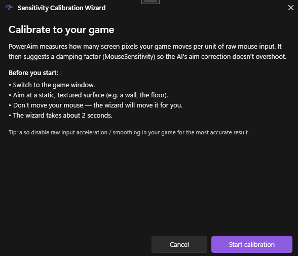

# Calibration Wizard

A guided 4-step wizard that **automatically measures your in-game sensitivity** and writes a `MouseSensitivity` value that matches. No more trial-and-error.

<!-- SCREENSHOT NEEDED: Calibration Wizard's "Welcome" step open over the main window. -->

## What it does

The wizard:

1. Temporarily forces `GlobalActive = false` so the aim pipeline doesn't fight the calibration
2. Sends a known sequence of mouse-delta impulses
3. Measures how much your in-game cursor actually moved by reading captured frames
4. Computes the multiplier needed to make PowerAim's pixel-deltas match in-game pixel-deltas
5. Offers to apply the result to `SliderSettings.MouseSensitivity`

It's the same logic you'd get from a 360°-rotation manual calibration, but driven from the screen capture so you don't need a math degree.

## How to use

1. Open the game you want to calibrate for. Be in a quiet area — no enemies, no UI overlays in the FOV.
2. Alt-tab back to PowerAim
3. **Aim Tools → AimConfig → Calibrate Sensitivity**
4. Read the welcome step, then click **Start Calibration**
5. The wizard runs for a few seconds; **don't move your mouse** during this period
6. The result step shows the suggested `MouseSensitivity`
7. Click **Apply** to write it to your config, or **Discard** to keep your old value

## Wizard states

The wizard cycles through four steps internally (you'll see all of them):

1. **Welcome** — explanation + Start button
2. **Running** — sends impulses, captures frames, computes
3. **Result** — shows the suggested value with Apply / Discard
4. **Error** — capture failed or detection was inconclusive

## Tips

- **Don't move your physical mouse during calibration.** Even small drift skews the measurement.
- **Calibrate per-game.** Different games have different mouse sensitivities and acceleration curves. Re-run the wizard whenever you switch games.
- **Calibrate after a config change.** If you change Mouse Movement Method (SendInput → LGHub etc.), re-run the wizard — different drivers send different deltas.
- **The wizard restores `GlobalActive`.** Whatever it was before you opened the wizard, that's what it'll be when the wizard closes — even on errors.

## Troubleshooting

- **"Calibration inconclusive"** — usually means the wizard couldn't detect a stable feature to track. Move closer to a wall or a clear texture and try again.
- **Result is wildly different from manual setting** — check the Mouse Movement Method. If you've recently switched from SendInput to LGHub, expect a different scale.
- **GlobalActive stays off after the wizard** — that's a bug; report it. Workaround: toggle Global Active on manually.
