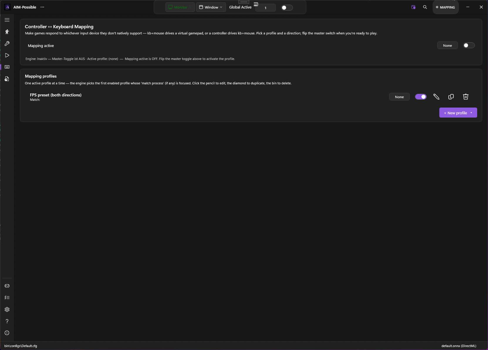
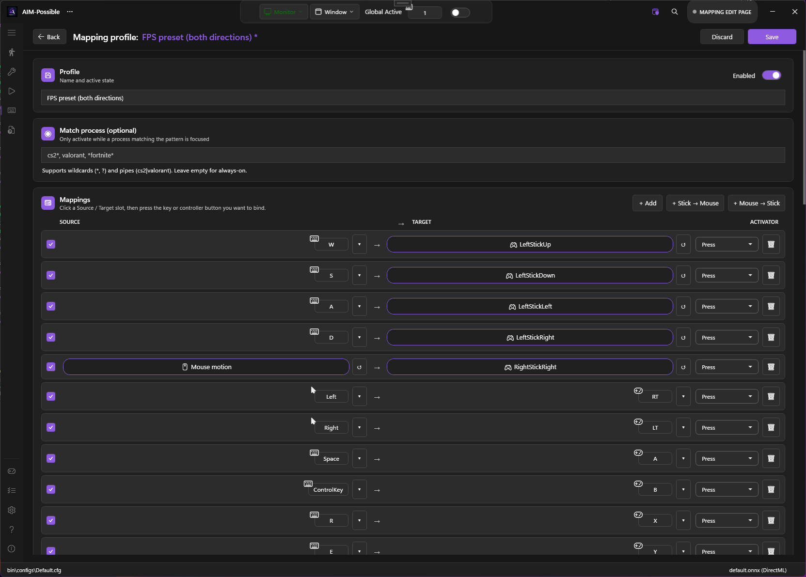
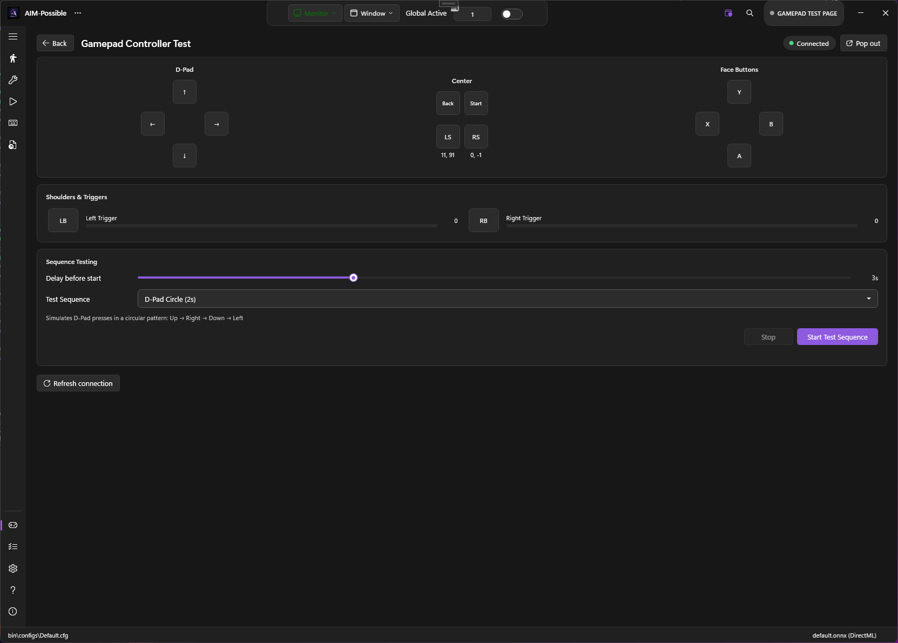

# Controller Mapping

PowerAim's controller-mapping engine lets you **remap keyboard/mouse → virtual Xbox controller**, **gamepad → keyboard+mouse**, or both at once. It's a reWASD-style engine: profiles, per-mapping activators (press / long-press / double-tap / toggle / pulse), stick deadzone + anti-deadzone + response curve, modifier (shift-layer) gates, and process-scoped auto-activation.

Use it to play gamepad-only games with KB+M, KB-only games with a controller, or to build hybrid bindings you can flip with a hotkey mid-match.

## Prerequisites

- **ViGEmBus** must be installed for any direction that writes to the virtual gamepad (KB+M → Pad). See [Installation]({{ '/getting-started/installation#5-optional-install-vigembus' | relative_url }}).
- **HidHide** is optional but recommended when your physical controller is plugged in — see [Hidden Controllers]({{ '/features/hidden-controllers' | relative_url }}).

## Core concepts

### Profile

A **profile** is a named bundle of mappings + stick-tuning parameters. Only one profile is active at a time (the first enabled profile whose `MatchProcess` matches the focused window). PowerAim ships several presets out of the box — see [Built-in presets](#built-in-presets).

### Mapping

A single rule that says **"when source X happens, fire target Y."**

| Kind | Source examples | Target examples |
|:-----|:----------------|:----------------|
| Keyboard key | `W`, `Space`, `LShift` | (used as source) |
| Mouse button | `Left`, `Right`, `Middle` | (used as source or target) |
| Gamepad button | `A`, `B`, `X`, `Y`, `LB`, `RB`, `LT-thumb`, `Start` | (used as source or target) |
| Gamepad trigger | `LT`, `RT` (analog slider) | analog stick deflection target |
| Gamepad stick direction | `LeftStickUp/Down/Left/Right`, `RightStickUp/...` | discrete direction (digital) |

Each mapping also has:

- **Enabled** — per-mapping switch
- **Activator** — press style (see below)
- **LongPressMs** — duration for long-press or pulse
- **Modifier** — optional second source that must be held for the mapping to fire (shift-layer / "LB+A → Y" patterns)

### Direction

Independent of profile contents, the user toggles which "side" should drive at runtime. The engine reads:

- **Both** — every mapping fires
- **KB → Pad** — only KB/M → Pad mappings fire
- **Pad → KB** — only Pad → KB/M mappings fire

A single profile with both directions lets you flip without re-editing.

### Activators

The activator picks **when** the target fires relative to the source:

| Activator | Fires when |
|:----------|:-----------|
| **Press** (default) | Target held while source is held; released when source releases |
| **LongPress** | Target fires only after source has been held for `LongPressMs` ms |
| **DoubleTap** | Target fires on a second press within ~320 ms of the first release |
| **Toggle** | Each press flips the target on/off (latching) |
| **Pulse** | Target presses for `LongPressMs` ms on each source press, then auto-releases |

`LongPressMs` defaults to **350 ms** (used as the hold time for LongPress and the pulse length for Pulse / DoubleTap; ignored by Press and Toggle).

Mix these in a single profile — one button can drive multiple mappings with different timings (e.g. A = Jump on Press, A = Crouch on LongPress 350 ms).

### Modifier (shift-layer)

Each mapping can have an optional **Modifier** — a second source that must be held for the mapping to fire. Example:

- `A → Y (no modifier)` — A drives Y normally
- `LB + A → B (modifier: LB)` — but while LB is held, A drives B instead

This is the canonical "shift layer" pattern from reWASD / Steam Input.

## How to enable

1. **Mapping** in the sidebar
2. Toggle **Active** at the top. This is the master switch for the whole engine (`ToggleState.MappingActive`); when off, no profile resolves and nothing is read or synthesised. It has a **global hotkey**, so you can flip mapping on/off mid-game without alt-tabbing back to PowerAim — see [Keybinds & Hotkeys]({{ '/configuration/keybinds-hotkeys' | relative_url }}).
3. Pick a direction: **Both / KB→Pad / Pad→KB**
4. Pick a profile from the list. Click **+ FPS preset** for one of the built-in starter profiles, or **+ New profile** for an empty one.
5. Click **Edit** to open the per-profile editor.

The status line at the bottom of the Mapping page shows the engine state: **Engine: Idle** / **Engine: Running (profile name)**.

## The profile editor

The editor has three main areas:

### 1. Profile-level settings

| Setting | What it does | Default |
|:--------|:-------------|:--------|
| **Name** | Display name | "Profile" |
| **Enabled** | Master switch (must be on for engine to consider this profile) | Off |
| **Match Process** | Wildcard pattern (e.g. `cs2|valorant`). Empty = always-on. | empty |
| **Stick-to-Mouse Sensitivity** | Pixels per tick at full stick deflection (Pad → mouse motion) | 12.0 |
| **Mouse-to-Stick Sensitivity** | Scale for synthesizing right-stick from mouse delta | 1.0 |
| **Stick Deadzone** | Below this fraction of full deflection, stick = centred (0.0–0.5) | 0.15 |
| **Stick Anti-Deadzone** | Minimum output as soon as the stick leaves the deadzone (0.0–0.5) | 0.0 |
| **Stick Response Curve** | Exponent applied to stick magnitude; ≥1.0 = slow center, fast edge | 1.0 |
| **Stick Mouse Exponent** | Same idea, dedicated to stick→mouse motion | 1.4 |
| **Invert Mouse Y** | Inverts Y when feeding right stick into mouse motion (or vice versa) | Off |

### 2. Mapping list

A table of all mappings in the profile. Each row:

- **Source chip** — click to re-bind. The chip enters "press a key/button now" mode and listens for the next input.
- **Target chip** — same, but for the target.
- **Activator dropdown** — Press / LongPress / DoubleTap / Toggle / Pulse
- **LongPressMs spinner** — visible when activator needs it
- **Modifier chip** — optional. Click to bind a second source.
- **Enabled checkbox** + **Delete** button

### 3. Special targets (the "Special..." dropdown)

When binding a source chip, you can also pick from a "Special" dropdown:

- **Stick directions** (`LeftStickUp`, `LeftStickDown`, ..., `RightStickRight`) — digital direction signals
- **Mouse motion sentinel** — special target meaning "feed mouse delta into the right stick" (KB→Pad direction) or "feed right stick into mouse motion" (Pad→KB direction)

The mouse-motion sentinel is what makes the right-stick / mouse-look mapping work — a single mapping enables the entire pump.

## Recording a mapping

The visual workflow:

1. Click an empty source slot → it enters "listening" mode (chip says "Press a key...")
2. Press the key, mouse button, or gamepad button on your real hardware
3. The chip captures the input and shows its name
4. Click the target slot
5. Press the key/button you want to *synthesize*
6. (Optional) Pick an activator, set the long-press duration, bind a modifier
7. Click **Save** to commit

For stick directions / mouse motion, use the **Special...** dropdown instead of pressing a key.

## Built-in presets

Available via the **"+ FPS preset" / "+ Driving preset" / ...** buttons on the profile list.

### FPS — KB → Pad

The canonical FPS keyboard-to-virtual-controller binding. WASD → left stick, mouse → right stick, LMB → RT, RMB → LT, Space → A, etc. Play console-only games with KB+M.

### FPS — Pad → KB

Reverse direction. Left stick → WASD, right stick → mouse motion, RT → LMB, LT → RMB, A → Space, etc. Play KB-only games with a controller.

### FPS — Both

The two presets above combined into one profile. The runtime direction picker (Both / KB→Pad / Pad→KB) decides which side actually fires.

### Driving — KB → Pad

A/D → left stick steering, W/S → triggers, Space → handbrake (A), LShift → up-shift (RB), Ctrl → down-shift (LB), etc. For arcade racers that gate KB+M players.

### Controller as Mouse

Right-stick → OS cursor motion, RT → LMB, LT → RMB, face buttons → Enter / Esc / Tab / Backspace, D-Pad → arrow keys, Start → Apps key. For couch use, accessibility, or grinding through menus without a keyboard.

## Stick tuning

The five stick-related sliders give you a reWASD-grade feel curve:

- **Deadzone** — your stick's resting wobble. Raise it to silence drift; lower for max sensitivity.
- **Anti-Deadzone** — many games have their own deadzones that swallow small inputs. Anti-deadzone snaps the output to a minimum value the moment the stick leaves your deadzone, so the game sees motion immediately.
- **Response Curve** — exponent on magnitude. `1.0` = linear; `1.4` = slow at center, fast at edge (good for fine aim); `2.0` = aggressive curve.
- **Stick Mouse Exponent** — same idea, applied only to stick→mouse motion. Lets you tune mouse feel without affecting other mappings.
- **Invert Mouse Y** — for "flight stick" Y-axis preference.

Tuning workflow:

1. Set Deadzone to 0.10 (or higher if your stick has drift).
2. Bump Anti-Deadzone to 0.10 — most games feel "twitchier" with this on.
3. Set Response Curve to 1.4 for general use, 1.8 for sniper aim.
4. Use the [Gamepad Tester](#gamepad-tester) to verify the output.

## Gamepad tester

The **Gamepad Tester** is a live visualization of both the physical controller (what your hardware says) and the virtual controller (what PowerAim is sending). It's the fastest way to confirm a mapping fires correctly.

Open it from:

- **Gamepad settings → Open Gamepad Tester** button
- **Mapping page → Open Tester** (pops out as a separate window so you can keep editing)

The tester floats above other windows so you can leave it open while editing mappings.

## Tips

- **Build profiles around games, not bindings.** "Apex Legends" with one profile, "Forza Horizon 5" with another. Use `MatchProcess` to auto-switch.
- **Toggle and Pulse are underused.** A toggle on a crouch button is much friendlier than a held-crouch.
- **The Modifier slot is the killer feature.** Bind `LB + A → Grenade` while keeping `A → Jump` as the default — same button does two things.
- **Mouse-look sensitivity tuning is two sliders.** `MouseToStickSensitivity` controls how much mouse motion equals stick deflection (KB → Pad); `StickToMouseSensitivity` is the reverse (Pad → KB).
- **The engine hot-reloads.** Edit a profile and watch the status line — changes apply immediately, no restart.

## Troubleshooting

- **Mappings don't fire** — check the Active toggle, the profile's Enabled state, and the Match Process pattern (if set, the foreground window must match).
- **KB → Pad direction does nothing in-game** — the game probably can't see the virtual controller. Install [HidHide]({{ '/features/hidden-controllers' | relative_url }}) and cloak your physical pad so the game only sees the virtual one.
- **Stick feels mushy / unresponsive** — bump Anti-Deadzone (0.10–0.15) and/or Response Curve (1.2–1.4).
- **Pulse keys don't release** — verify `LongPressMs` isn't set to 0; that's a no-op.
- **Modifier mapping fires both with and without modifier** — make sure you set `ModifierKind` (not `None`). The modifier slot is empty by default.
- **Tester shows my buttons but game ignores them** — see [Gamepad Not Detected]({{ '/troubleshooting/gamepad-not-detected' | relative_url }}).
