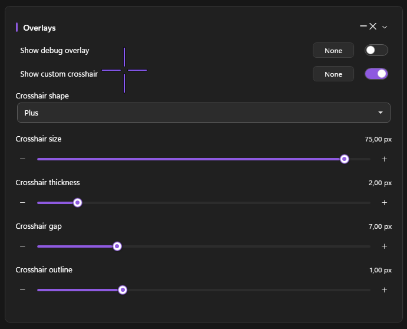

# Crosshair Overlay

A topmost custom crosshair drawn over the game. Useful when the game's own crosshair is too small, too colorful for your monitor, or hidden by hipfire spread.

<!-- SCREENSHOT NEEDED: In-game with PowerAim's custom Plus crosshair (purple, 16 px, 4 px gap) drawn over the game's own reticle. -->

## What it does

The crosshair overlay is a click-through, transparent WPF window painted at the exact center of your active monitor. It updates as you change shape / color / size on the Settings page.

## How to enable

**Settings → Overlays → Show Custom Crosshair**

The crosshair appears immediately when you toggle it on. It survives alt-tab and stays on top of fullscreen games (using DXGI capture exclusion — see [Hide UI from capture]({{ '/configuration/settings-overview#hide-ui-from-capture' | relative_url }})).

## Configuration options

All settings live on the **Overlays** card in **Settings**.

| Setting | What it does | Default |
|:--------|:-------------|:--------|
| **Crosshair Shape** | Dot / Cross / Plus / Circle / CircleDot / T | Plus |
| **Crosshair Size** | Total size in pixels (4–80) | 16 |
| **Crosshair Thickness** | Stroke width (1–10) | 2 |
| **Crosshair Gap** | Center gap for Plus / Cross (0–30) | 4 |
| **Crosshair Outline** | Outline thickness (0–6) — 0 disables the outline | 1 |
| **Color** | ARGB hex (set elsewhere via the color picker) | `#FF8B5CF6` (PowerAim purple) |
| **Outline Color** | Outline ARGB hex | `#FF000000` (black) |

## The six shapes

- **Dot** — single filled circle at the center
- **Cross** — `+` without a center gap
- **Plus** — `+` with a center gap (the default)
- **Circle** — open ring
- **CircleDot** — open ring + center dot
- **T** — three-arm crosshair (omits the bottom)

## Tips

- **Outline 1 with a dark outline color** makes the crosshair readable over both light and dark backgrounds.
- **Small Plus with a 4 px gap** is the most "professional" look — visible but doesn't cover the head.
- **For RTS / strategy games**, use Dot — keeps the crosshair tiny so you can see what you're clicking.

## Troubleshooting

- **Crosshair appears off-center** — PowerAim draws it at the *display center*, not the game center. If your game window isn't fullscreen on the same monitor PowerAim is targeting, the crosshair will be off.
- **Game minimizes when I toggle it on** — that's the WPF window stealing focus. Re-focus the game manually. (We're working on a fix.)
- **Crosshair is captured by my recording software** — disable **Hide UI from Capture** on the Settings page. (The opposite is the usual problem — the crosshair shouldn't be visible to OBS by default.)
