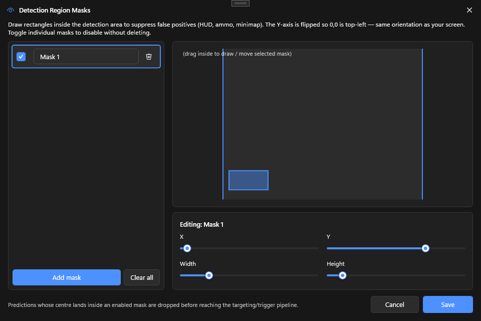

# Detection Masks

Rectangular regions of the captured frame that the inference pipeline **ignores**. Use them to blank out HUD elements (ammo counters, minimaps, killfeed) that some models hallucinate enemies into.

## What it does

Each mask is a rectangle in **normalized image space** (0–1 in both axes). Before detection runs, PowerAim zeros out the pixels inside every enabled mask. The model sees no signal there and cannot fire a false-positive into a mask.

Multiple masks can be combined — useful for games with HUDs scattered across multiple corners.

## How to enable

1. **Aim Tools → PredictionConfig → Detection Masks**
2. The dialog opens with a live capture preview
3. **Drag** on the preview to create a new mask, **or** click **+ Add Mask**
4. Select a mask in the list to edit it
5. **Drag the rectangle on the preview** to move it, **or** use the sliders below to set exact coordinates
6. Per-mask checkboxes let you toggle individual masks without deleting them
7. Click **Save** when done — Cancel discards changes

The Masking master toggle on the Aim Assist card (or via hotkey) enables or disables all masks at once.

## When to use

- **Bottom-center killfeed** in CS2 / Valorant — these often contain player portraits that older models latch onto
- **Minimap corner** in any game — abstract shapes get detected as low-confidence players
- **Ammo / weapon panel** — bright icons and numbers
- **Crosshair art** — if the in-game crosshair somehow matches a class in your model

## Tips

- **Start with the killfeed.** It's by far the most common false-positive source.
- **Use the Test toggle.** Toggle masks off / on while looking at the [Debug Overlay]({{ '/features/debug-overlay' | relative_url }}) — you should see the false positives disappear.
- **Masks are per-config.** Save your config after editing masks; loading another config replaces them.
- **Masks affect performance only marginally.** The mask is applied as a single memset before inference.

## Troubleshooting

- **Mask appears in the wrong place** — coordinates are normalized. If you change FOV size or image size, masks scale with the FOV but stay in their normalized position.
- **Mask doesn't seem to do anything** — confirm the Masking master toggle is on. The dialog edits a working copy; you must click Save to commit.
- **Detection still fires into the masked area** — increase the mask's size a little; YOLO inference involves anchor boxes that can extend slightly outside the activation region.
