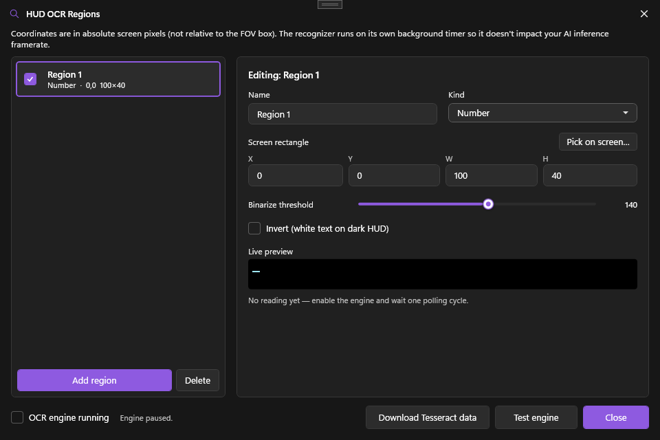

# OCR HUD Reader

A periodic Tesseract-based OCR engine that reads named rectangular regions of your screen and exposes the recognized text. Use it to track health, ammo, score, or any other on-screen number — and feed the values into triggers or AutoPlay.

## What it does

On each tick (default every 500 ms), the OCR engine:

1. Captures each enabled region as a small Bitmap
2. Optionally binarizes it (threshold + invert)
3. Runs Tesseract 5.2 with English-language data
4. Post-processes per region kind (Number = digits only, Health = number + slash, Text = free-form)
5. Stores the result in `OcrService.Latest`

Other PowerAim subsystems read those values: [triggers]({{ '/features/triggers#ocr-conditions' | relative_url }}) gate on them, [aim-disengage rules](#aim-disengage-rules) pause assist on them, and [aim profiles]({{ '/features/aim-assist#aim-profiles' | relative_url }}) can auto-switch on a weapon-name match. AutoPlay also biases its tactics off them. You can see every reading live in the dialog and in the [debug overlay]({{ '/features/debug-overlay' | relative_url }}).

## How to enable

1. **Settings → HUD OCR → Enable HUD OCR**
2. Click **Configure OCR Regions**
3. In the dialog, click **+ Add Region**
4. Draw the region directly on the captured frame (click-and-drag)
5. Pick the **Kind**: Text / Number / Health
6. Optionally enable **Invert** and adjust **Threshold** for clearer OCR
7. Hit **Test engine** to load Tesseract and start the live preview

### On-screen region picker

Two ways to position a region without guessing pixel coordinates:

- **Pick on screen** (in the dialog) temporarily hides the dialog and lets you drag a rectangle straight over your HUD; the captured coordinates are written back into the selected region.
- The **OCR Regions overlay** (Settings → Overlays, or the dialog's visual-edit button) shows a labelled rectangle for every enabled region with its live recognised value. Its **edit mode** makes those rectangles draggable and resizable on the live HUD, writing straight back to the same regions.

## Bundled Tesseract engine

PowerAim ships a Tesseract 5.2 LSTM engine; it only needs the `eng.traineddata` language model to run.

- **Download Tesseract data** — the dialog's one-click downloader fetches `eng.traineddata` into `%LocalAppData%\PowerAim\tessdata\` (or your override folder). It's idempotent — it does nothing if the file is already there.
- **Test engine** — forces a synchronous engine load and reports whether Tesseract is actually wired up (surfacing any missing-DLL or load error) *before* you start adding regions. As a convenience it also flips **Enable HUD OCR** on so the live preview starts feeding.
- **Tessdata Path** — if you'd rather supply your own data, point this field on the Settings card to your folder; empty means use the default location above.

## Configuration options

### Settings card

| Setting | What it does | Default |
|:--------|:-------------|:--------|
| **Enable HUD OCR** | Master toggle | Off |
| **OCR Interval** | Polling interval in ms (100–5000) | 500 |
| **Tessdata Path** | Override the data folder | empty (= default) |

### Per-region

| Setting | What it does |
|:--------|:-------------|
| **Name** | Free text — used by consumers to look up the value |
| **X / Y / Width / Height** | Pixel rectangle on the captured frame |
| **Enabled** | Per-region toggle (lets you keep regions defined but inactive) |
| **Kind** | Text / Number / Health — drives post-processing |
| **Invert** | Invert the binarized image (for white-on-dark HUDs) |
| **Threshold** | Binarization cutoff (0–255). 140 default. |

To set the rectangle, you can type the **X / Y / Width / Height** values, use the dialog's **Pick on screen** button (it hides the dialog and lets you drag a box over your HUD), or hand it off to the on-screen [OCR Regions overlay]({{ '/features/ocr#on-screen-region-picker' | relative_url }}) for live drag-and-resize.

### Recognition tuning

The dialog has an **Engine options** section with extra recognition tweaks. **All default OFF** so existing setups behave exactly as before, and each targets one specific failure mode — they can help *or* hurt depending on the HUD, so flip them one at a time and watch the live preview. They take effect immediately.

| Option | What it does | When to try it |
|:-------|:-------------|:---------------|
| **Max-channel grayscale** (`UseMaxChannelGrayscale`) | Builds the grayscale from the max of the colour channels (HSV *value*) instead of luminance-weighted Y. Saturated coloured digits (a magenta "10") keep a high value instead of collapsing to mid-grey below your threshold. For non-coloured text it's identical to the default. | A coloured-text region misreads while a neighbouring white-text one works. **Try this first.** |
| **Substitute letters → digits** (`SubstituteLettersToDigits`) | Fixes common letter↔digit confusions before digit-only stripping: `O o Q D → 0`, `l I i \| ! ] → 1`, `Z z → 2`, `S s → 5`, `b → 6`, `B → 8`, `g q → 9`. | An ammo / health counter consistently reads as text-with-digits. Off by default because it can also "fix" real letters into wrong digits. |
| **Strict number parsing** (`StrictNumberParsing`) | Rejects a parse with no actual digit (so a stray speckle that survived thresholding as `.` / `..` no longer parses as `0`) and trims stray leading/trailing dots. | Recommended on. Off only for strict backwards compatibility. |
| **Otsu fallback** (`UseOtsuFallback`) | When a Number/Health region's primary (fixed-threshold) pass returns no number, retries once with Otsu's automatic threshold. | **High false-positive risk** — on noisy / saturated regions Otsu can read speckle as multi-digit numbers. Only for very stable HUDs where the fixed threshold is *just barely* off. |
| **300-DPI hint** (`UseUserDefinedDpi`) | Tells Tesseract the input is 300 DPI (`user_defined_dpi=300`) so the LSTM engine stops auto-rescaling already-upscaled HUD patches. The pixel density doesn't have to actually match. | Engine output looks blurry or wobbly. Flipping it transparently rebuilds the engine on the next sample. |
| **Sticky last-valid (ms)** (`StickyLastValidMs`) | For Number/Health regions, when a frame fails to parse but the previous reading succeeded and is still within this many ms, the prior value is carried forward. Stops single bad frames (motion blur, muzzle flash, partial occlusion) from flickering consumers between "value X" and "nothing". Cannot manufacture wrong values — only holds real prior ones. | Recommended 1500–2000 ms. `0` = off (default). Clamped 0–10000. |

## Tips

- **Keep regions tight.** 100×40 around the ammo number is way faster than scanning a 400×400 corner.
- **Binarize when the font is anti-aliased.** Tesseract works best on clean black-on-white. Try the Invert toggle if the font is light on dark.
- **500 ms is fine for health.** Don't drop the interval below 200 ms unless you really need it — OCR is CPU-bound and adds latency.
- **Health = "75/100".** The Health kind strips spaces but preserves the slash so consumers can split it.

## Aim-disengage rules

OCR can also **pause aim assist** while a HUD region matches — for example, stop aiming while you're scoped, holding a knife, or in a menu. This avoids fighting the player during moments where assist is unwanted.

{: .important }
Disengage rules now live **on each aim profile, not globally.** They're carried by the active [aim profile]({{ '/features/aim-assist#aim-profiles' | relative_url }}) and evaluated only for whichever profile is currently active — so a "sniper" profile can disengage when *not* scoped while a "rifle" profile uses different rules (or none). Edit them from the profile editor, not from a global card. New profiles start with no rules; when your config was migrated, the **Default** profile inherited the old global rules.

Each rule has:

| Field | What it does |
|:------|:-------------|
| **Condition** | An AND/OR-able **condition tree** — same builder and operator set as [trigger OCR conditions]({{ '/features/triggers#ocr-conditions' | relative_url }}). Each leaf picks a region, a comparison and a value, so you can express compound rules like *(weapon contains `AWP` OR weapon contains `Scout`) AND state contains `scoped`*. (Configs that predate the tree migrate their single region/comparison/value into one leaf automatically.) |
| **Match Process** | Optional process pattern to scope the rule to one game |
| **Enabled** | Per-rule toggle |

While **any** enabled rule on the active profile matches, [Aim Assist]({{ '/features/aim-assist' | relative_url }}) is held off until the rule stops matching.

{: .important }
Like trigger conditions, aim-disengage rules are **only evaluated while the OCR engine is on**. If OCR is off, no rule pauses aim.

## Profile auto-switch

Beyond pausing aim, an OCR reading can **swap your whole aim profile**. Give a profile an OCR region plus a weapon-name substring and enable **Auto-switch on OCR**; the profile activates whenever that region's recognised text contains the substring — e.g. switch to a high-smoothing sniper profile the moment the HUD shows `AWP`. See [Aim profiles]({{ '/features/aim-assist#aim-profiles' | relative_url }}).

## Use cases

- **Auto-reload when ammo is low.** A trigger reads OCR ammo, fires `R` when ammo < 5.
- **Gate triggers on the HUD.** Use [OCR trigger conditions]({{ '/features/triggers#ocr-conditions' | relative_url }}) so a trigger only fires while ammo or health is in range.
- **Pause aim while scoped or knifing.** An aim-disengage rule on a "weapon" region keeps assist from interfering during melee or aim-down-sights.
- **AutoPlay aggression.** AutoPlay knows when health is low and biases toward retreat actions.
- **Stream overlay.** Pipe OCR values out to your stream without OBS plugins.

## Troubleshooting

- **OCR returns garbage** — sharper image needed: tighten the region, bump threshold, try Invert.
- **No `tessdata` found** — verify the Tessdata Path on the Settings card points at a folder containing `eng.traineddata`.
- **OCR seems off** — confirm the region is correct on the live preview in the dialog. The capture source must include your HUD.
- **High CPU** — raise OCR Interval or disable the more expensive regions.
- **Tessdata download failed** — drop `eng.traineddata` manually into `%LocalAppData%\PowerAim\tessdata\` from the [official Tesseract releases](https://github.com/tesseract-ocr/tessdata).
