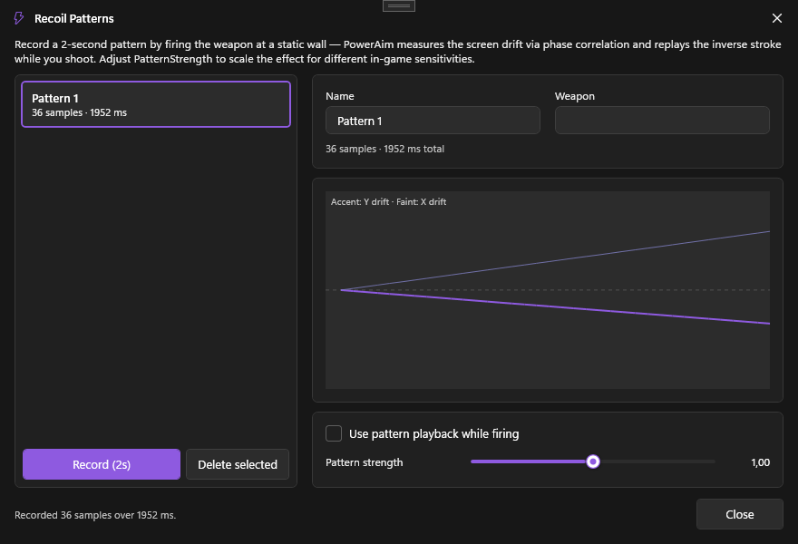

# Recoil Patterns

Record the recoil drift of a specific gun, save it as a named pattern, and play it back to perfectly counter the spray.

Patterns are the data that the **PatternPlayback** mode of an [Anti-Recoil profile]({{ '/features/anti-recoil' | relative_url }}) replays. Record a pattern here, then reference it by name from a profile — the library is shared across every profile.

## What it does

A pattern is a list of timestamped 2D deltas — a recording of how the crosshair drifted while you held fire. At playback, PowerAim re-applies those deltas (scaled by `PatternStrength`) while you hold the anti-recoil key.

Patterns are stored under `AppConfig.AntiRecoilSettings.Patterns` and persist with the config.

## How to record a pattern

1. **Aim Tools → AntiRecoil → Recoil Patterns**
2. Click **+ New Pattern**, name it (e.g. "AK-47")
3. In-game, point at a flat wall
4. Click **Record** in the dialog
5. **Spray your weapon onto the wall for ~3 seconds**
6. Click **Stop** (or the button again — recording is cooperative; clicking it twice aborts)
7. Inspect the drift-curve preview — it should look like the gun's spray pattern (typically up + slight zig-zag)

PowerAim suspends `GlobalActive` while recording so the aim pipeline doesn't fight you. It's restored when the recording window closes.

## How to arm a pattern

Patterns are no longer armed from this dialog directly — they're referenced from an [Anti-Recoil profile]({{ '/features/anti-recoil' | relative_url }}) in **PatternPlayback** mode:

1. **Aim Tools → Anti-Recoil → +** to create a profile (or edit an existing one)
2. Set **Mode = PatternPlayback**
3. Pick this pattern from the dropdown
4. Adjust **Pattern Strength** (per-profile, 1.0 = exact)
5. Save, then activate the profile (row toggle, hotkey, or OCR match)
6. Make sure the master **Anti-Recoil** toggle is on, then hold the **Anti-Recoil Keybind** in-game while firing — the pattern plays back

## How to share a pattern

Patterns are part of your config (`.cfg` file). If you save your config after creating a pattern, the next person who loads it gets the pattern too. There's currently no per-pattern export — share configs instead.

## Configuration options

Pattern playback is configured **per profile** (see [Anti-Recoil]({{ '/features/anti-recoil' | relative_url }})), not globally:

| Profile setting | What it does | Default |
|:----------------|:-------------|:--------|
| **Mode = PatternPlayback** | Picks pattern replay as this profile's engine | (n/a) |
| **PatternName** | Which named pattern from the library to replay | empty |
| **PatternStrength** | Multiplier applied to every sample (0–3) | 1.0 |

## Tips

- **Record at the same in-game sensitivity you'll play at.** Patterns are pixel-deltas in screen space; changing sensitivity changes how much pixel-movement a given mouse-delta produces.
- **Patterns work best on full-auto weapons with a consistent spray.** Burst weapons with controlled bursts are also fine. Pure-RNG buckshot guns don't have a pattern.
- **Use the strength slider to share patterns across players.** If a friend uses your "AK-47" pattern but their sensitivity is 1.5× yours, `PatternStrength = 1.5` will scale it correctly.
- **Reduce sample noise**: shoot at a uniform wall, not a textured one. PowerAim's recorder uses the same image-tracking as the BETA anti-recoil — busy textures hurt accuracy.

## Troubleshooting

- **Pattern "drifts" off-target** — strength too high, or the pattern was recorded at a different sensitivity. Try `PatternStrength = 0.85` and ramp up.
- **Pattern feels jerky** — record a fresh one in a quieter area. The recorder is sensitive to camera shake from movement keys.
- **Playback runs out before the magazine** — the pattern is shorter than your spray. Record a longer pattern (hold fire longer during recording).
- **Pattern playback fights image-based anti-recoil** — only one profile is active at a time now; if you see two engines fighting, you have an extra action wired up somewhere else. Re-check which profile is the active one.
