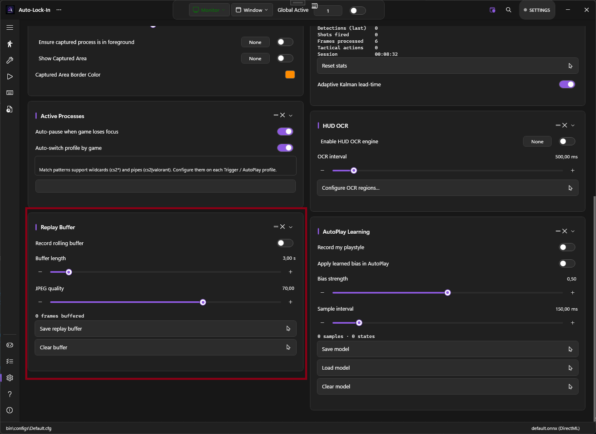

# Replay Buffer

A rolling in-memory buffer of the last N seconds of captured frames and their detections. One click exports the buffer to disk as a PNG sequence plus a JSON sidecar — useful for clipping that one play, debugging a model that misses targets, or building a training dataset.



## What it does

While **Record Rolling Buffer** is on, every captured frame is JPEG-encoded and pushed into a ring buffer sized at roughly `BufferSeconds × FPS`. Older frames are evicted automatically. When you click **Save Replay Buffer**, PowerAim writes:

```
%LocalAppData%\PowerAim\replays\<timestamp>\
├── frame_0001.jpg
├── frame_0002.jpg
├── ...
└── predictions.json     # bbox + class id + confidence per frame
```

The export folder is configurable on the same card.

## How to enable

**Settings → Replay Buffer → Record Rolling Buffer**

A live status line under the sliders shows the current frame count: `Frames buffered: 73`.

## Configuration options

| Setting | What it does | Default |
|:--------|:-------------|:--------|
| **Record Rolling Buffer** | Master toggle | Off |
| **Buffer Length** | Seconds of history to keep (1–30) | 3 |
| **JPEG Quality** | 10–100. Lower = smaller buffer, more compression artefacts. | 70 |
| **Export Folder** | Optional override. Empty = `%LocalAppData%\PowerAim\replays`. | empty |

3 seconds at 60 FPS at quality 70 = roughly 10–30 MB of RAM.

## Tips

- **Use it for bug reports.** "Model misses headshots when the player crouches in shade" is much more useful with an attached 3-second replay folder.
- **Use it as a training-data farm.** Combined with [Collect Data While Playing]({{ '/configuration/settings-overview#collect-data-while-playing' | relative_url }}), the buffer's PNGs are exactly the format MakeSense.ai wants.
- **Lower quality is fine for debugging.** Quality 40 still shows targets clearly and halves the RAM footprint.
- **The buffer is per-session.** Closing PowerAim discards anything unsaved.

## Troubleshooting

- **"Frames buffered: 0" — toggle is on but nothing accumulates** — Global Active must also be on; the AI loop doesn't run otherwise.
- **Export fails / produces no folder** — check disk space and that the export folder is writable.
- **Frames are dropped** — the buffer tracks `DroppedSinceLastExport` internally; if the AI loop runs much faster than the encoder, some frames get dropped to keep memory bounded. Lower JPEG quality or reduce buffer length.
