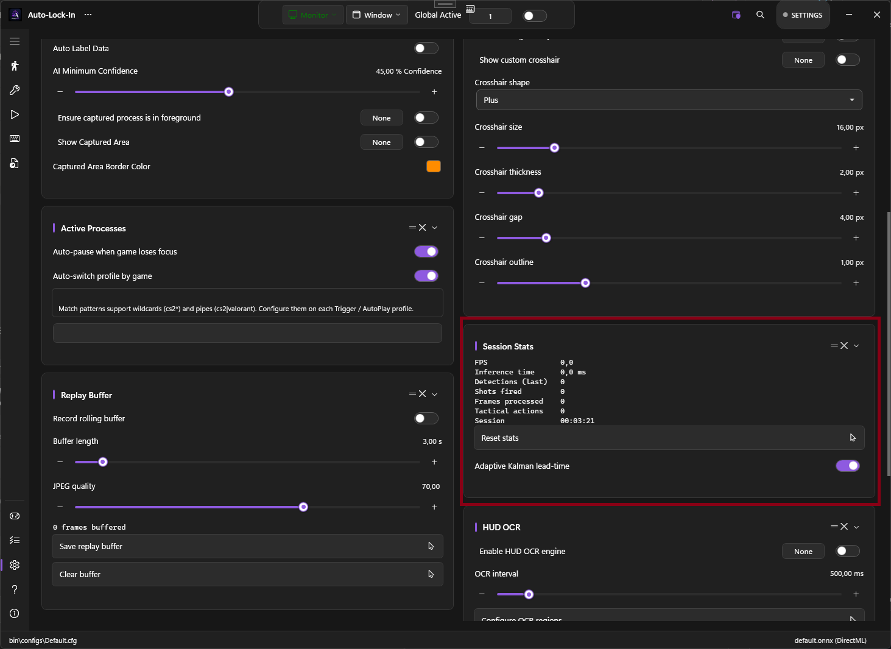

# Session Stats

A live metrics panel on the Settings page showing how PowerAim is performing during your session. It's the non-overlay version of the [Debug Overlay]({{ '/features/debug-overlay' | relative_url }}).

## What it shows

| Metric | Meaning |
|:-------|:--------|
| **FPS** | Instantaneous AI-loop frames per second |
| **Inference Time** | Most-recent ONNX forward-pass time (ms) |
| **Detections (last)** | Detection box count on the most recent frame |
| **Shots Fired** | Triggers fired this session |
| **Frames Processed** | Running total |
| **Tactical Actions** | AutoPlay actions taken this session |
| **Session** | `hh:mm:ss` since reset |

A **Reset Stats** button clears the session counters back to zero. The session timer restarts.

## Adaptive Kalman Lead

Below the stats is an **Adaptive Kalman Lead** toggle. When on, the Kalman filter's lead time auto-adapts to the measured target velocity — lower lead at low speeds (avoids overshooting), higher lead at high speeds (compensates for delay).

When off, the lead time is a fixed parameter.

## Tips

- **Use FPS to validate model size.** If you've just switched models or sizes, glance at the FPS number — if it dropped below 60 you'll feel it as input lag.
- **Watch Shots Fired during practice.** The counter is a quick way to see how many fires your triggers attempted in a 10-minute warmup session.
- **Reset between sessions.** The default behavior is to keep counting; if you want clean stats per match, hit Reset before queueing.

## How it relates to the Debug Overlay

The [Debug Overlay]({{ '/features/debug-overlay' | relative_url }}) shows the same numbers but on top of every other window — useful in-game. The Session Stats card is the in-app version — useful while configuring PowerAim.
