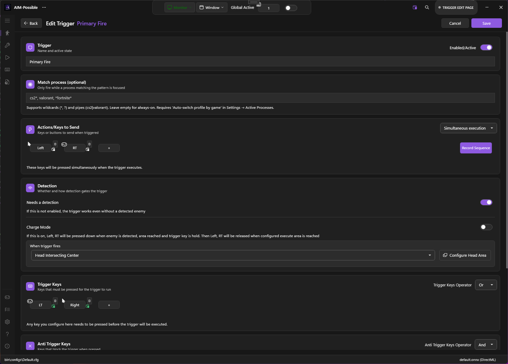

# Triggers (AutoTrigger)

PowerAim's trigger system is a complete rewrite of the original Aimmy autotrigger. Each profile holds an **arbitrary number of independent triggers** — each with its own keys, actions, intersection checks, and timing.


<!-- SCREENSHOT NEEDED: Aim Tools page scrolled to the Triggers card with 2-3 triggers in the list and the Edit button on one of them. -->

## What it does

While **AutoTrigger** is on, each defined trigger watches its keys + intersection rules and fires its configured actions when both are satisfied.

Use cases:

- Auto-fire when the crosshair sits inside the head area (`HeadIntersectingCenter`)
- Auto-throw a grenade after holding G for half a second (Delay + Action)
- Pre-aim with charge mode: hold the trigger, release when the head enters the kill zone
- Fire only while `LMB AND Shift` are both held, but never while `R` or `Tab` are held (anti-trigger)

## How to enable

1. **Aim Tools → AutoTrigger → toggle on**
2. The trigger list shows your current triggers. Each row has:
   - Name + active state
   - Quick description (keys + actions + intersection)
   - Toggle, Edit, Delete buttons
3. Click **+ New Trigger** at the bottom to create one, or **Edit** to open the full editor.

## The trigger editor

The trigger editor is the heart of the system. Open it via **Edit** on any trigger row.


<!-- SCREENSHOT NEEDED: Trigger editor dialog open, showing the Name field, key/action chips, intersection-check dropdowns, and the live head-area preview. -->

### Identification

- **Name** — free text, shown in the trigger list and in the active-trigger status line
- **Enabled** — master switch for this trigger
- **Match Process** — optional process-name pattern. When set, this trigger only activates while the matching process is in the foreground. Supports wildcards (`*`, `?`) and pipes (`cs2|valorant`). See [Per-game profiles]({{ '/configuration/per-game-profiles' | relative_url }}).

### Trigger keys

- **Trigger Keys** — keys/buttons that must be held for the trigger to fire. Can be any mix of keyboard keys, mouse buttons, gamepad buttons, and gamepad triggers (LT / RT).
- **Trigger Keys Operator** — `AND` (all keys held) or `OR` (any key held).
- **Anti-Trigger Keys** — keys that **block** firing while held (e.g. `R` so you don't fire mid-reload).
- **Anti-Trigger Keys Operator** — `AND` / `OR` for the anti-keys, same semantics.

### Actions

The list of inputs the trigger sends when it fires. Mix any of:

- Keyboard keys (`Keys.Space`, etc.)
- Mouse buttons (`MouseButtons.Left`)
- Gamepad buttons (`GamepadButton.A`)
- Gamepad sliders (`GamepadSlider.RightTrigger`)

**Execution Mode:**
- **Sequential** — fire actions one after another, with `FirePressDelay` between them
- **Simultaneous** — fire all actions at once (default)

### Intersection checks

Triggers can require the detected target to **intersect** the screen center in a specific way. Two checks are evaluated:

| Check | Meaning |
|:------|:--------|
| `None` | No spatial requirement — fires purely on the key check |
| `IntersectingCenter` | The full detection box must include the screen center |
| `HeadIntersectingCenter` | The head sub-region of the detection box must include the screen center |

For `HeadIntersectingCenter`, you also pick a sub-rectangle of the bounding box (the "head area"). The editor has a live preview showing where that sub-rectangle is relative to the detected player.

### Charge mode

When **Charge Mode** is on, the trigger has **two** intersection checks:

- **Begin Intersection Check** — when satisfied, the trigger **starts holding** the action (e.g. starts holding LMB to pre-aim).
- **Execution Intersection Check** — when satisfied, the trigger **completes** (releases the action).

Use case: hold LMB while the enemy is in your wider FOV, then release the click exactly when their head crosses the center.

### Timing

- **Delay** — wait this long after the keys/intersection are satisfied before firing (seconds).
- **Break Time** — minimum wait between consecutive fires (seconds). Used to throttle rapid-fire actions.

### Needs detection

If **Needs Detection** is off, the trigger fires purely on the key state — useful for binding macros without a target requirement (e.g. "Press G + delay 500 ms + press LMB" = grenade-cook macro).

## Default profile

PowerAim ships a default `Primary Fire` trigger:

```
Name: Primary Fire
Trigger Keys: LeftTrigger OR RightMouseButton
Action: LeftMouseButton
Execution: HeadIntersectingCenter
Charge Mode: off
```

## Tips

- **Use Anti-Trigger Keys liberally.** Adding `R, Tab, ScrollLock` to every fire-trigger's anti-keys saves you from accidental fires during reload / scoreboard / map view.
- **Charge Mode shines for sniper rifles.** Set `BeginIntersectionCheck = IntersectingCenter`, `ExecutionIntersectionCheck = HeadIntersectingCenter`. You pre-aim while the body enters the FOV, fire when the head crosses center.
- **Match Process lets you reuse one PowerAim install across games.** Create one trigger per game with `MatchProcess = cs2.exe`, `valorant.exe`, etc., and PowerAim only arms the trigger that matches the focused game.
- **Sequential execution + small Delay = scripted combo.** Useful for grenade pulls or quick-switch macros.

## Troubleshooting

- **Trigger doesn't fire at all** — check the master AutoTrigger toggle, the Global Active master toggle, and the trigger's own enabled state.
- **Trigger fires too often** — raise the Break Time slider.
- **Trigger fires too late** — lower the Delay slider, or lower `FirePressDelay` on the Settings page.
- **Charge Mode releases too early** — increase the size of the Execution Intersection Area.
- **Trigger ignores my anti-key** — verify the anti-key is actually a held key (not a one-shot press). The anti-key has to be `IsHolding` true at the moment of fire.
