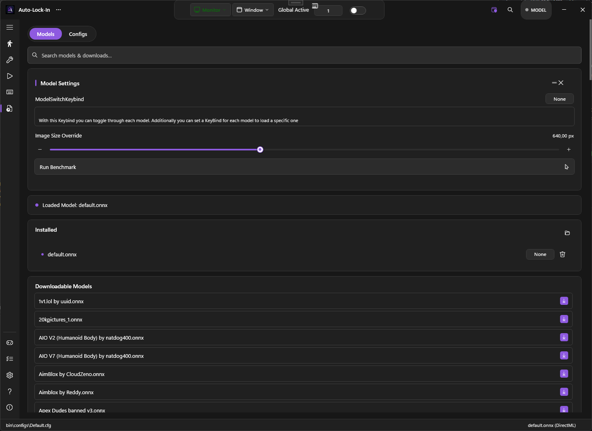
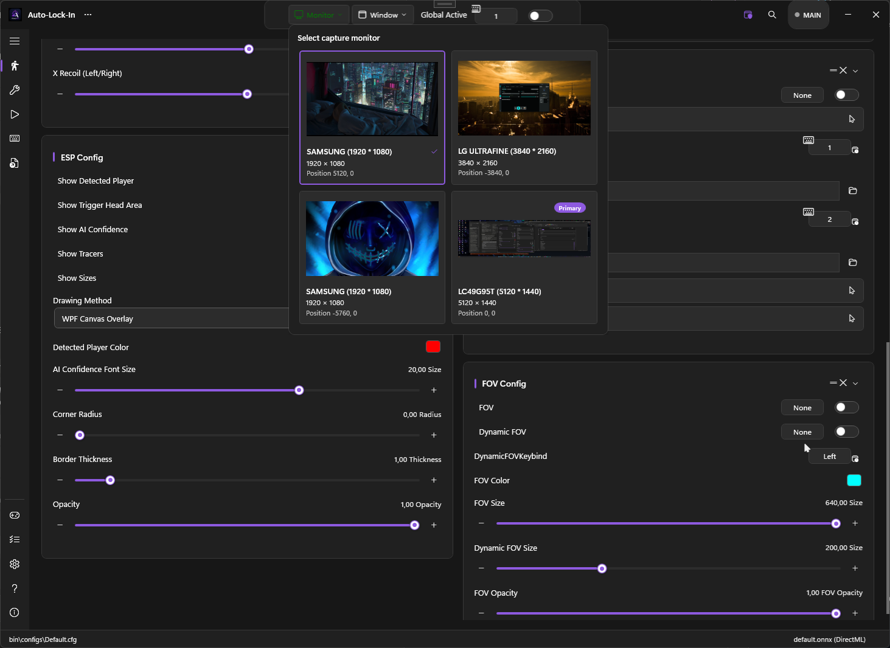

# Your First Aim

A 5-minute quick win: launch PowerAim, pick a model, and see the crosshair track a target.

This guide assumes you have already [installed PowerAim]({{ '/getting-started/installation' | relative_url }}).

## 1. Launch PowerAim

Start `PowerAim.exe`. The main window opens with a sidebar on the left and an empty content area — there is no model loaded yet, so most cards are hidden.

## 2. Load a model

Click **Models & Configs** in the sidebar. PowerAim ships several models in `bin\models\` and shows more in the **Downloadable Models** strip.

Click any model file (e.g. `Universal.onnx`). When loading completes you'll see:

- The model's name appears in the bottom status bar
- The Aim Tools sidebar entry becomes the obvious next stop

{: .tip }
The bundled **Universal** models are good starting points — they're trained on a broad mix of FPS games. For a specific game, check the downloadable list for a game-specific model.

## 3. Verify the capture source

Center of the title bar shows the current capture target — by default that's your main monitor. Click the monitor selector if you have multiple displays or want to capture a specific window.

## 4. Pick the aim key

Click **Aim Tools** in the sidebar. The first card, **Aim Assist**, contains:

- A master toggle ("Aim Assist")
- **Aim Key Bindings** — keys that arm the aim while held
- Toggles for Prediction and EMA Smoothening

By default, the aim key is **Right Mouse Button** + **Left Alt**. To change it, click the key chip and press the new key/button.

## 5. Enable Global Active

At the top of the window is the master toggle, called **Global Active**. Until that's on, PowerAim does nothing — the AI loop runs but it never moves the mouse.

Toggle it on. The window picks up an accent-color glow to indicate "live."

## 6. Try it in-game

Alt-tab to your game. Hold the aim key — PowerAim should start nudging your crosshair toward the closest detected target inside the FOV circle.

If nothing happens:

- Make sure the **Aim Assist** card toggle is on (not just Global Active)
- Make sure the model recognizes whatever the game shows on screen — enable **Show Detected Player** in the ESPConfig card to see live detections
- Check the [Troubleshooting]({{ '/troubleshooting/' | relative_url }}) section if you still see nothing

<!-- SCREENSHOT NEEDED (../images/detected-player-overlay.png): Game with detected-player boxes drawn over enemies — illustrates the ESP overlay. -->

## What next?

Once it works:

1. **[Calibrate your sensitivity]({{ '/features/calibration-wizard' | relative_url }})** — the wizard auto-tunes PowerAim's `MouseSensitivity` slider to match your in-game sens.
2. **[Tweak the AimConfig]({{ '/features/aim-assist' | relative_url }})** — Y/X offset (head vs. body), EMA smoothening, the movement path curve.
3. **[Set up a trigger]({{ '/features/triggers' | relative_url }})** — auto-fire when the crosshair sits on the head area.
4. **[Run the benchmark]({{ '/models/using-models' | relative_url }})** — Models tab → "Run Benchmark" picks the best model resolution for your hardware.
5. **[Enable per-game profiles]({{ '/configuration/per-game-profiles' | relative_url }})** — PowerAim auto-switches the trigger / mapping profile when you alt-tab to a different game.

{: .note }
The full configuration story is on the [Configuration overview]({{ '/configuration/' | relative_url }}) page.
