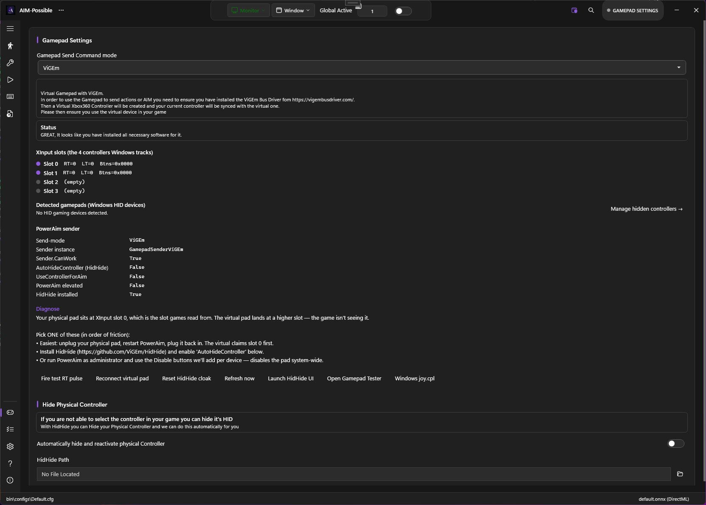

# Installation

PowerAim is a portable Windows desktop app. There is no required installer — you can run it from any folder, including a USB stick. An optional installer is provided that creates Start-menu shortcuts and a Programs-and-Features entry.

## 1. Install the prerequisites

Both are one-time installs. Skip whichever you already have.

1. **.NET Runtime 10 (x64)** — [download here](https://dotnet.microsoft.com/en-us/download/dotnet/10.0)
   - Pick the *Desktop Runtime* (not the SDK) unless you plan to build PowerAim from source.
2. **Visual C++ 2015-2022 Redistributable (x64)** — [download here](https://aka.ms/vs/17/release/vc_redist.x64.exe)

{: .warning }
Both must be **x64** — PowerAim does not work with the x86 / ARM variants. If you accidentally install x86, uninstall it and grab x64.

## 2. Pick a build: DirectML or CUDA

PowerAim ships two release flavors:

| Build | File name pattern | Hardware |
|:------|:------------------|:---------|
| **DirectML** (default) | `PowerAim-*.zip` or `PowerAim-*-Installer.exe` | Any DX12-capable GPU |
| **CUDA** (faster on NVIDIA) | `PowerAim-*_cuda.zip` or `*_cuda-Installer.exe` | NVIDIA GPU + CUDA 12.x runtime |

If unsure, **start with DirectML**. You can switch later from the Settings page without losing your config.


## 3. Download

Grab the latest release from the [Releases page](https://github.com/fgilde/AI-Ming/releases). Each release has four assets:

```
PowerAim-x.y.z.zip                  # DirectML, portable
PowerAim-x.y.z-Installer.exe        # DirectML, with installer
PowerAim-x.y.z_cuda.zip             # CUDA, portable
PowerAim-x.y.z_cuda-Installer.exe   # CUDA, with installer
```

## 4. Install

### Option A — Installer (recommended)

Run `PowerAim-*-Installer.exe`. It places PowerAim into `%LocalAppData%\Programs\PowerAim`, adds a Start-menu shortcut, and registers an uninstaller. No admin rights required.

### Option B — Portable

Extract the `.zip` to a folder of your choice (e.g. `C:\Tools\PowerAim`). Run `PowerAim.exe` from inside.

{: .note }
The first launch is slower than subsequent ones — PowerAim probes DXGI support, loads ONNX models, and initializes the binding hook. After that, cold start is under 2 seconds on most machines.

## 5. (Optional) Install ViGEmBus

If you plan to use any gamepad feature — controller mapping, AutoPlay with gamepad output, or "Use controller for aim" — install ViGEmBus.

Easiest path:

1. Launch PowerAim
2. Open **Gamepad** in the sidebar
3. Click **"Get ViGEmBus driver"** — it opens [vigembusdriver.com](https://vigembusdriver.com) in your browser
4. Download and run `ViGEmBus_Setup_x.x.xx_x64.exe`
5. Back in PowerAim, click any other sidebar item then click **Gamepad** again — the status line should now say "PowerAim is ready to send Gamepad signals"



## 6. (Optional) Install HidHide

Only needed if you want to **cloak your physical controller** from games while a mapping profile is active. PowerAim ships the installer — on the Gamepad settings page, click **"Install HidHide"** and follow the prompts. A reboot is required.

See [Hidden Controllers]({{ '/features/hidden-controllers' | relative_url }}) for what HidHide does and when you need it.

## Where PowerAim stores its data

| Location | What lives there |
|:---------|:-----------------|
| `<install dir>\bin\models\*.onnx` | Bundled and downloaded ONNX models |
| `<install dir>\bin\configs\*.cfg` | Saved configuration presets |
| `<install dir>\bin\anti_recoil_configs\*` | Per-gun recoil config files |
| `%AppData%\AI-M\LastConfigPath.cfg` | Pointer to the config that was loaded last |
| `%LocalAppData%\PowerAim\tessdata\` | Tesseract OCR data |
| `%LocalAppData%\PowerAim\replays\` | Replay-buffer export folder (default) |
| `%LocalAppData%\PowerAim\autoplay_model.json` | Recorded AutoPlay learning model (default) |

The whole app is portable — copying the install directory to another machine preserves all bundled assets. Per-user state lives under `%LocalAppData%` and `%AppData%` and is not copied.

## Uninstalling

- **Installer build:** Settings → Apps → PowerAim → Uninstall
- **Portable build:** delete the folder. Optionally also delete `%LocalAppData%\PowerAim` and `%AppData%\AI-M`.

If you installed ViGEmBus and / or HidHide and want them gone too, uninstall them separately from Windows Settings.

## Updating

PowerAim ships with an in-app update checker. When a new release is available you'll see a notice bar at the bottom of the window — click it to open the UpdateDialog, which downloads and applies the new build in place.

If you'd rather update manually, just download a fresh release and overwrite the install directory. Your config (under `bin\configs\` and `%AppData%\AI-M\`) is preserved.
