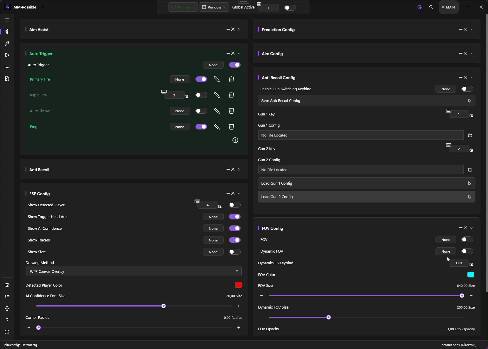
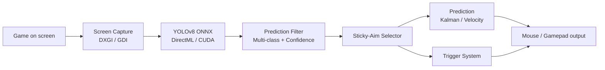

# PowerAim Documentation
{: .fs-9 }

A modern, AI-powered aim alignment tool for accessibility, training, and fun — built on .NET 10 and WPF with a Fluent UI, ONNX/DirectML/CUDA inference, gamepad support, OCR, and an LLM-driven AutoPlay system.
{: .fs-6 .fw-300 }

[Get Started](getting-started/){: .btn .btn-primary .fs-5 .mb-4 .mb-md-0 .mr-2 }
[View on GitHub](https://github.com/fgilde/AI-Ming){: .btn .fs-5 .mb-4 .mb-md-0 }

---

## What is PowerAim?

PowerAim captures the screen, runs a YOLOv8 ONNX model on the frame, and nudges the mouse (or virtual controller) toward the detected target. Everything is **fully configurable**, **100% local**, and **100% free** — no ads, no key system, no paywalled features.

It started as a fork of [Babyhamsta/Aimmy](https://github.com/Babyhamsta/Aimmy) but has been heavily reworked: a decoupled service architecture, a complete trigger-system overhaul, a Fluent-styled UI, gamepad / AutoPlay support, localization in 9 languages, dynamic model sizes, and a much faster capture & inference pipeline.

{: .important }
PowerAim is **source-available** under the **PolyForm Noncommercial** license. Commercial use, including commercial forks, is prohibited. See [Source-Available]({{ '/advanced/source-available' | relative_url }}).

---

## Who is this for?

- Physically or visually impaired gamers
- Players who want to drive their pointer with the keyboard, an eye-tracker, or a single hand
- People practicing reaction time / hand-eye coordination
- Anyone training their FPS aim mechanically
- Long-session players who develop fatigue or sweaty hands
- Researchers / hobbyists interested in real-time object detection on the desktop

---

## Quick links

| Topic | Description |
|:------|:------------|
| [Getting Started]({{ '/getting-started/' | relative_url }}) | Download, install, and land your first aim |
| [Features]({{ '/features/' | relative_url }}) | Every user-facing feature in detail |
| [Models]({{ '/models/' | relative_url }}) | Download, switch, and train your own ONNX models |
| [Configuration]({{ '/configuration/' | relative_url }}) | Settings, per-game profiles, hotkeys, config file |
| [Controller Mapping]({{ '/features/controller-mapping' | relative_url }}) | Use a KB+M to play a gamepad title (or vice versa) |
| [AutoPlay]({{ '/features/autoplay' | relative_url }}) | Let a local LLM play the game for you |
| [Troubleshooting]({{ '/troubleshooting/' | relative_url }}) | When things go wrong |

---

## How it works

Each block is an independent service (`ICapture`, `IPredictionLogic`, `IAction`) — the capture loop, the inference pipeline, the trigger logic, and the aim/output loop communicate through clear contracts.

For more, see the [Architecture overview]({{ '/advanced/architecture' | relative_url }}).

---

## Key features at a glance

- **DXGI Desktop Duplication** capture (~6× faster than GDI) with automatic fallback
- **YOLOv8 ONNX** with dynamic input sizes and per-class filtering
- **DirectML and CUDA** execution providers (two release builds)
- **Sticky Aim** target lock between frames — no flicker on overlapping detections
- **5 movement paths** — Cubic Bezier, Lerp, Exponential, Adaptive, Perlin-noise jitter
- **Custom 2D Kalman** filter with lead-time prediction
- **Complete trigger system** with multi-trigger profiles, charge mode, AND/OR operators
- **3 anti-recoil modes** — static patterns, recorded patterns, image-based phase correlation
- **Custom crosshair, debug overlay, FOV circle**, replay buffer, OCR
- **Controller mapping** — full reWASD-style KB↔Pad mapping engine with profile presets
- **AutoPlay** — Ollama-driven LLM that controls your character
- **9 languages** — English, German, Spanish, French, Italian, Russian, Turkish, Ukrainian, Chinese
- **Per-game profiles** with foreground process matching
- **Calibration wizard** that measures your in-game sensitivity automatically

{: .tip }
New to PowerAim? Jump straight to [Your first aim]({{ '/getting-started/first-aim' | relative_url }}) for a 5-minute quick win.
